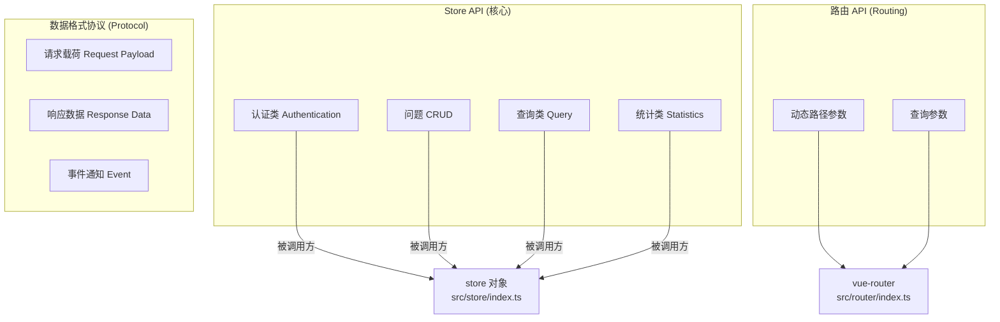

# API 接口文档 (API Definitions)

> **生成时间**: 2026-04-27
> **关联文件**: [`index.md`](index.md) | [`data-models.md`](data-models.md) | **语言**: 中文 (zh-CN)

---

## 概述

本文档定义 QA Live Healthcare 系统**所有可编程接口**。由于本项目为**纯前端应用（无后端服务）**，所谓"API"指的是：

1. **Store 公开方法接口** — 视图组件与状态管理层的交互契约
2. **内部数据流协议** — 组件间数据传递的格式规范
3. **路由参数接口** — URL 参数的格式与约束

### 接口分类总览



---

## 一、Store 方法接口 (Store Public API)

**接口位置**：[`src/store/index.ts`](../src/store/index.ts)  
**访问方式**：`import { store } from '../store'`  
**调用模式**：`store.methodName(params)` （同步调用）

---

### 1.1 认证类接口 (Authentication)

#### `loginDoctor`

医生登录认证。

| 属性 | 值 |
|------|-----|
| **方法签名** | `loginDoctor(username: string, password: string): Doctor \| null` |
| **所属模块** | 认证 |
| **调用者** | [`DoctorLogin.vue`](../src/views/DoctorLogin.vue#L81) |
| **同步/异步** | 同步 |
| **副作用** | 设置 `state.currentDoctor` |

**参数 (Request)**:

| 参数名 | 类型 | 必填 | 说明 | 示例 |
|--------|------|------|------|------|
| `username` | `string` | 是 | 医生用户名 | `"dr-zhang-wei"` |
| `password` | `string` | 是 | 登录密码 | `"123456"` |

**响应 (Response)**:

| 场景 | 返回类型 | 值说明 |
|------|----------|--------|
| 验证通过 | `Doctor` | 匹配的 Doctor 完整对象 |
| 验证失败 | `null` | 用户名或密码不匹配 |

**业务规则**：
- 在 `state.doctors` 数组中查找 `username` 和 `password` 同时匹配的记录
- 密码比较为**明文匹配**（仅适用于演示环境）
- 成功后自动设置 `state.currentDoctor = doctor`

**调用示例**：
```typescript
const doctor = store.loginDoctor('dr-zhang-wei', '123456');
if (doctor) {
  message.success('登录成功');
  router.push(`/doctor/room/${doctor.username}`);
} else {
  message.error('用户名或密码错误');
}
```

---

#### `logoutDoctor`

医生登出。

| 属性 | 值 |
|------|-----|
| **方法签名** | `logoutDoctor(): void` |
| **所属模块** | 认证 |
| **调用者** | [`DoctorRoom.vue`](../src/views/DoctorRoom.vue#L167) |
| **副作用** | 清除 `state.currentDoctor` |

**参数**：无

**响应**：无返回值 (`void`)

**行为**：将 `state.currentDoctor` 重置为 `null`。

---

#### `verifyPatient`

患者身份验证 / 自动注册。

| 属性 | 值 |
|------|-----|
| **方法签名** | `verifyPatient(name: string, birthday: string): Patient` |
| **所属模块** | 认证 |
| **调用者** | [`Consultation.vue`](../src/views/Consultation.vue#L234) |
| **副作用** | 可能新增 Patient 到 `state.patients`；设置 `state.currentPatient` |

**参数 (Request)**:

| 参数名 | 类型 | 必填 | 说明 | 格式约束 |
|--------|------|------|------|----------|
| `name` | `string` | 是 | 患者姓名 | 任意非空字符串 |
| `birthday` | `string` | 是 | 出生日期 | `YYYY-MM-DD` 格式 |

**响应 (Response)**:

始终返回 `Patient` 对象（不会返回 null）：

```typescript
// 返回值结构
{
  id: string;       // 已有患者用原 ID，新建患者用 `patient{timestamp}`
  name: string;     // 与传入参数一致
  birthday: string; // 与传入参数一致
  phone: string;    // 已有患者保留原值，新建为空字符串 ''
  gender: string;   // 已有患者保留原值，新建为空字符串 ''
}
```

**业务规则**：

```
输入 name + birthday
       │
       ▼
┌──────────────────────┐     找到      ┌─────────────────┐
│ patients 数组查找   │─────────────▶│ 返回已有 Patient │
│ name + birthday 匹配│              │ currentPatient=它 │
└──────────┬───────────┘              └─────────────────┘
           │ 未找到
           ▼
┌──────────────────────┐
│ 创建新 Patient 对象  │
│ id = patient+时间戳  │
│ phone='', gender=''  │
│ push 到 patients 数组│
│ currentPatient=它    │
└──────────────────────┘
```

**注意**：新建的患者仅在内存中存在，刷新页面后丢失。

---

#### `logoutPatient`

患者登出/切换用户。

| 属性 | 值 |
|------|-----|
| **方法签名** | `logoutPatient(): void` |
| **所属模块** | 认证 |
| **调用者** | [`Consultation.vue`](../src/views/Consultation.vue#L244) |
| **副作用** | 清除 `state.currentPatient` |

**参数**：无

**响应**：`void`

---

### 1.2 问题操作类接口 (Question CRUD)

#### `addQuestion`

提交新的问诊问题。

| 属性 | 值 |
|------|-----|
| **方法签名** | `addQuestion(data: Omit\<Question, 'id' \| 'submitTime' \| 'status' \| 'answer' \| 'answerTime'\>): Question` |
| **所属模块** | 问题创建 |
| **调用者** | [`Consultation.vue`](../src/views/Consultation.vue#L285) |
| **副作用** | 向 `state.questions` 添加新记录 |

**参数 (Request Payload)**:

| 字段名 | 类型 | 必填 | 说明 | 示例 |
|--------|------|------|------|------|
| `patientId` | `string` | 是 | 提问患者的 ID | `"patient001"` |
| `patientName` | `string` | 是 | 患者姓名（冗余存储） | `"赵明"` |
| `doctorId` | `string` | 是 | 目标医生的 ID | `"doc001"` |
| `doctorName` | `string` | 是 | 医生姓名（冗余存储） | `"张伟医生"` |
| `question` | `string` | 是 | 问题正文内容 | `"血压最近有点高..."` |

> **Omit 说明**：`id`、`submitTime`、`status`、`answer`、`answerTime` 由方法内部自动填充，无需调用方提供。

**响应 (Response)**:

返回完整创建的 `Question` 对象：

```json
{
  "id": "q1740398400000",
  "patientId": "patient001",
  "patientName": "赵明",
  "doctorId": "doc001",
  "doctorName": "张伟医生",
  "question": "血压最近有点高...",
  "submitTime": "2026-04-27T06:40:00.000Z",
  "status": "pending",
  "answer": null,
  "answerTime": null
}
```

**自动填充字段详情**：

| 自动字段 | 生成逻辑 |
|----------|----------|
| `id` | `` `q${Date.now()}` `` — 时间戳前缀 `q` |
| `submitTime` | `new Date().toISOString()` — ISO 8601 UTC 时间 |
| `status` | 固定 `'pending'` — 新问题初始状态 |
| `answer` | 固定 `null` |
| `answerTime` | 固定 `null` |

---

#### `answerQuestion`

医生以文字方式回复问题。

| 属性 | 值 |
|------|-----|
| **方法签名** | `answerQuestion(questionId: string, answer: string): void` |
| **所属模块** | 问题更新 |
| **调用者** | [`DoctorRoom.vue`](../src/views/DoctorRoom.vue#L203) |
| **副作用** | 更新指定 Question 的 status/answer/answerTime |

**参数 (Request)**:

| 参数名 | 类型 | 必填 | 说明 | 示例 |
|--------|------|------|------|------|
| `questionId` | `string` | 是 | 目标问题 ID | `"q004"` |
| `answer` | `string` | 是 | 医生的回复内容 | `"建议先做心电图检查..."` |

**响应**：`void`（无返回值，但修改了原始对象）

**副作用详情**：

```typescript
// 内部执行以下变更
question.status = 'answered';                    // pending → answered
question.answer = answer;                        // null → 回复文本
question.answerTime = new Date().toISOString();  // null → 当前时间
```

---

#### `markQuestionAsAnswered`

标记问题已解答（用于口述/线下回复场景）。

| 属性 | 值 |
|------|-----|
| **方法签名** | `markQuestionAsAnswered(questionId: string): void` |
| **所属模块** | 问题更新 |
| **调用者** | [`DoctorRoom.vue`](../src/views/DoctorRoom.vue#L212) |
| **副作用** | 将问题标记为已解答，answer 设为固定文本 |

**参数 (Request)**:

| 参数名 | 类型 | 必填 | 说明 |
|--------|------|------|------|
| `questionId` | `string` | 是 | 目标问题 ID |

**响应**：`void`

**与 `answerQuestion` 的区别**：

| 特性 | `answerQuestion` | `markQuestionAsAnswered` |
|------|-------------------|--------------------------|
| 回复内容来源 | 医生手动输入（动态） | 固定文本 `"已口述解答"` |
| 使用场景 | 文字在线回复 | 口头告知/电话回复/线下诊疗 |
| 参数数量 | 2 个（ID + 内容） | 1 个（仅 ID） |

---

### 1.3 查询类接口 (Query)

#### `getQuestionsByDoctor`

获取指定医生的所有问题列表。

| 属性 | 值 |
|------|-----|
| **方法签名** | `getQuestionsByDoctor(doctorId: string): Question[]` |
| **所属模块** | 查询 |
| **调用者** | [`DoctorRoom.vue`](../src/views/DoctorRoom.vue#L139) |
| **只读** | ✅ 无副作用 |

**参数**：

| 参数名 | 类型 | 必填 | 说明 |
|--------|------|------|------|
| `doctorId` | `string` | 是 | 医生 ID |

**响应 (Response)**:

```typescript
Question[]  // 该医生关联的所有问题（含 pending 和 answered）
```

**使用场景**：在 DoctorRoom 中分别 `.filter(q => q.status === 'pending')` 和 `.filter(q => q.status === 'answered')` 得到两个子列表。

---

#### `getQuestionsByPatient`

获取指定患者的所有问题列表。

| 属性 | 值 |
|------|-----|
| **方法签名** | `getQuestionsByPatient(patientId: string): Question[]` |
| **所属模块** | 查询 |
| **调用者** | [`Consultation.vue`](../src/views/Consultation.vue#L181) |
| **只读** | ✅ 无副作用 |

**参数**：

| 参数名 | 类型 | 必填 | 说明 |
|--------|------|------|------|
| `patientId` | `string` | 是 | 患者 ID |

**响应**：`Question[]`

---

#### `getActiveDoctors`

获取当前在线的医生列表。

| 属性 | 值 |
|------|-----|
| **方法签名** | `getActiveDoctors(): Doctor[]` |
| **所属模块** | 查询 |
| **调用者** | [`Home.vue`](../src/views/Home.vue#L122)、[`Consultation.vue`](../src/views/Consultation.vue#L209) |
| **只读** | ✅ 无副作用 |

**参数**：无

**响应**：`Doctor[]` — 过滤条件：`doctor.isActive === true`

---

#### `getDoctorByUsername`

根据用户名查找医生。

| 属性 | 值 |
|------|-----|
| **方法签名** | `getDoctorByUsername(username: string): Doctor \| undefined` |
| **所属模块** | 查询 |
| **调用者** | [`Consultation.vue`](../src/views/Consultation.vue#L216) |
| **只读** | ✅ 无副作用 |

**参数**：

| 参数名 | 类型 | 必填 | 说明 |
|--------|------|------|------|
| `username` | `string` | 是 | 医生用户名（如 `"dr-zhang-wei"`） |

**响应**：

| 场景 | 返回值 |
|------|--------|
| 找到匹配 | `Doctor` 对象 |
| 未找到 | `undefined` |

---

### 1.4 统计类接口 (Statistics)

#### `getStatistics`

获取平台全局统计数据。

| 属性 | 值 |
|------|-----|
| **方法签名** | `getStatistics(): StatisticsResult` |
| **所属模块** | 统计 |
| **调用者** | [`Home.vue`](../src/views/Home.vue#L121) |
| **只读** | ✅ 无副作用 |

**参数**：无

**响应 (Response)**：

```typescript
interface StatisticsResult {
  totalDoctors: number;    // 医生总数 (= state.doctors.length)
  totalQuestions: number;  // 问题总数 (= state.questions.length)
  activeSessions: number;  // 待响应问题数 (= status === 'pending' 的计数)
  totalSessions: number;   // 在线诊室数 (= isActive === true 的计数)
}
```

**示例返回值**（基于当前预设数据）：

```json
{
  "totalDoctors": 5,
  "totalQuestions": 7,
  "activeSessions": 4,
  "totalSessions": 4
}
```

---

## 二、完整 API 速查表

| # | 方法名 | 类别 | 参数 | 返回值 | 副作用 | 调用位置 |
|---|--------|------|------|--------|--------|----------|
| 1 | `loginDoctor(username, password)` | 认证 | `(string, string)` | `Doctor \| null` | ✅ 设置 currentDoctor | DoctorLogin |
| 2 | `logoutDoctor()` | 认证 | - | `void` | ✅ 清除 currentDoctor | DoctorRoom |
| 3 | `verifyPatient(name, birthday)` | 认证 | `(string, string)` | `Patient` | ⚠️ 可能新增 patient | Consultation |
| 4 | `logoutPatient()` | 认证 | - | `void` | ✅ 清除 currentPatient | Consultation |
| 5 | `addQuestion(data)` | 问题CRUD | `Partial<Question>` | `Question` | ✅ push 到 questions | Consultation |
| 6 | `answerQuestion(id, answer)` | 问题更新 | `(string, string)` | `void` | ✅ 修改 question 状态 | DoctorRoom |
| 7 | `markQuestionAsAnswered(id)` | 问题更新 | `(string)` | `void` | ✅ 修改 question 状态 | DoctorRoom |
| 8 | `getQuestionsByDoctor(id)` | 查询 | `(string)` | `Question[]` | ❌ 无 | DoctorRoom |
| 9 | `getQuestionsByPatient(id)` | 查询 | `(string)` | `Question[]` | ❌ 无 | Consultation |
| 10 | `getActiveDoctors()` | 查询 | - | `Doctor[]` | ❌ 无 | Home, Consultation |
| 11 | `getDoctorByUsername(name)` | 查询 | `(string)` | `Doctor \| undefined` | ❌ 无 | Consultation |
| 12 | `getStatistics()` | 统计 | - | `StatisticsResult` | ❌ 无 | Home |

---

## 三、路由参数接口 (Routing Parameters)

### 3.1 动态路径参数

| 路由模式 | 参数名 | 类型 | 来源 | 说明 |
|----------|--------|------|------|------|
| `/consultation/:doctorUsername` | `doctorUsername` | `string` | URL 路径 | 指定目标医生的诊室入口 |
| `/doctor/room/:username` | `username` | `string` | URL 路径 | 当前登录医生的诊室标识 |

**获取方式**：

```typescript
import { useRoute } from 'vue-router';

const route = useRoute();

// Consultation.vue 中
const doctorUsername = route.params.doctorUsername as string;

// DoctorRoom.vue 中
const username = route.params.username as string;
```

**参数约束**：

| 参数 | 格式 | 合法值示例 | 非法示例 |
|------|------|-----------|-----------|
| `doctorUsername` | `dr-{pinyin-name}` | `dr-zhang-wei`, `dr-li-na` | `zhangwei`, `DR-ZHANG` |
| `username` | `dr-{pinyin-name}` | `dr-zhang-wei`, `dr-li-na` | 同上 |

**处理未匹配情况**：

```typescript
// Consultation.vue: 未找到或离线时忽略该参数
const doctor = store.getDoctorByUsername(doctorUsername);
if (doctor && doctor.isActive) {
  selectedDoctor.value = doctor;   // 仅当医生存在且在线时使用
}

// DoctorRoom.vue: 未登录时强制重定向
onMounted(() => {
  if (!currentDoctor.value || currentDoctor.value.username !== username) {
    message.error('请先登录');
    router.push('/doctor/login');  // 权限不足则跳转登录页
  }
});
```

---

## 四、组件间数据交互协议

### 4.1 Props 传递约定

本项目**组件间几乎不使用 Props 传递数据**（除 App.vue → RouterView 的隐式传参）。各视图组件均通过 **Store 全局状态** 获取所需数据。

唯一的数据传递场景是 **App.vue** 的布局壳：

```
App.vue
  ├─ <AppHeader />          ← 无 props，内部自行读取 router
  ├─ <RouterView />         ← Vue Router 注入 route 组件
  └─ <AppFooter />           ← 无 props，纯静态展示
```

### 4.2 事件通信约定

| 事件源 | 事件类型 | 处理方式 | 示例 |
|--------|----------|----------|------|
| 表单提交 | `@finish` (Ant Design Form) | 直接调用 Store 方法 | `@finish="verifyPatient"` |
| 按钮点击 | `@click` | 调用本地方法→Store | `@click="submitQuestion"` |
| 路由变化 | `watch(route.path)` | 更新菜单高亮状态 | AppHeader.vue |
| 生命周期 | `onMounted` | 初始化逻辑/权限校验 | DoctorRoom.vue, Consultation.vue |

### 4.3 Modal 弹窗数据协议

项目中使用了两种 Ant Design Modal 模式：

#### 提交问题弹窗 (Consultation.vue)

```
触发: showSubmitModal()
打开: submitModalVisible = true

表单字段:
  ├── doctorId: string          (Select 下拉选择，可选医生为 getActiveDoctors())
  └── question: string          (Textarea 多行文本)

提交: submitQuestion()
  └── 调用 store.addQuestion({patientId, patientName, doctorId, doctorName, question})
关闭: closeSubmitModal()
  └── submitModalVisible = false, 清空 questionForm
```

#### 回复问题弹窗 (DoctorRoom.vue)

```
触发: showAnswerModal(question: Question)
打开: answerModalVisible = true
      selectedQuestion = question (保存上下文)

展示信息:
  ├── 患者名: selectedQuestion.patientName
  └── 问题内容: selectedQuestion.question

表单字段:
  └── answerText: string        (Textarea 多行文本)

提交: submitAnswer()
  └── 调用 store.answerQuestion(selectedQuestion.id, answerText)
关闭: closeAnswerModal()
  └── 清空 selectedQuestion 和 answerText
```

---

## 五、错误码与异常处理

### 5.1 Store 方法错误处理

当前 Store 方法**不抛出异常**，而是通过**返回值**表达错误状态：

| 错误场景 | 方法 | 返回值 | 调用方处理方式 |
|----------|------|--------|---------------|
| 登录凭证错误 | `loginDoctor` | `null` | `if (!doctor) { message.error(...) }` |
| 医生不存在 | `getDoctorByUsername` | `undefined` | `if (doctor && doctor.isActive) { ... }` |

### 5.2 表单验证错误

由 Ant Design Form 组件内置处理：

```typescript
const authRules = {
  name: [{ required: true, message: '请输入姓名' }],
  birthday: [{ required: true, message: '请选择生日' }],
};

// 表单仅在 @finish 回调中触发（已通过验证）
<a-form :rules="authRules" @finish="verifyPatient">
```

### 5.3 业务逻辑校验

在方法调用前进行前置校验（Guard Clause 模式）：

```typescript
const submitQuestion = () => {
  if (!questionForm.doctorId) {           // 校验 1
    message.error('请选择医生');
    return;
  }
  if (!questionForm.question.trim()) {    // 校验 2
    message.error('请输入问题');
    return;
  }
  // ... 正常逻辑
};
```

---

## 六、未来后端 API 对接参考

当项目从 Mock 数据迁移至真实后端时，可将当前 Store 方法映射为 HTTP API：

| 当前 Store 方法 | 建议 REST API | HTTP Method | Path |
|----------------|--------------|-------------|------|
| `loginDoctor` | 登录 | POST | `/api/auth/doctor/login` |
| `logoutDoctor` | 登出 | POST | `/api/auth/doctor/logout` |
| `verifyPatient` | 患者验证/注册 | POST | `/api/auth/patient/verify` |
| `logoutPatient` | 患者登出 | POST | `/api/auth/patient/logout` |
| `addQuestion` | 创建问题 | POST | `/api/questions` |
| `answerQuestion` | 回复问题 | PUT | `/api/questions/:id/answer` |
| `markQuestionAsAnswered` | 标记已解答 | PATCH | `/api/questions/:id/status` |
| `getQuestionsByDoctor` | 医生问题列表 | GET | `/api/doctors/:id/questions` |
| `getQuestionsByPatient` | 患者问题列表 | GET | `/api/patients/:id/questions` |
| `getActiveDoctors` | 在线医生列表 | GET | `/api/doctors?isActive=true` |
| `getDoctorByUsername` | 按用户名查医生 | GET | `/api/doctors?username=:name` |
| `getStatistics` | 平台统计 | GET | `/api/statistics` |

**建议迁移策略**：

1. 保持 Store 的**接口签名不变**
2. 在 Store 方法内部将 `return data` 替换为 `fetch('/api/...')`
3. 引入 `async/await` + loading 状态
4. 添加统一错误拦截器（axios interceptors）

---

*此文件由 Context Builder 自动生成，属于 [index.md](index.md) 上下文体系的补充文档。*
