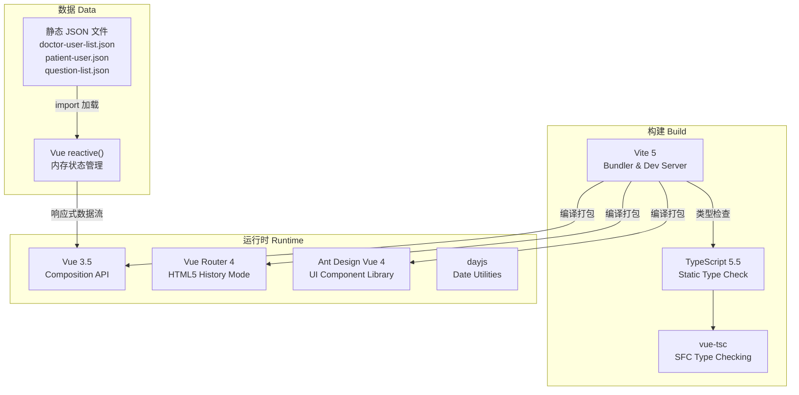
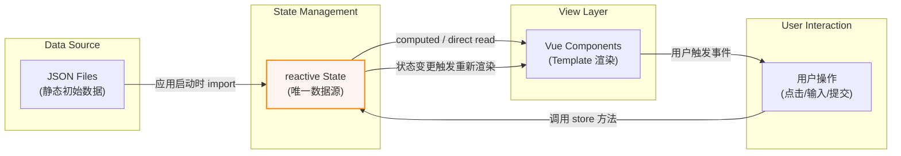
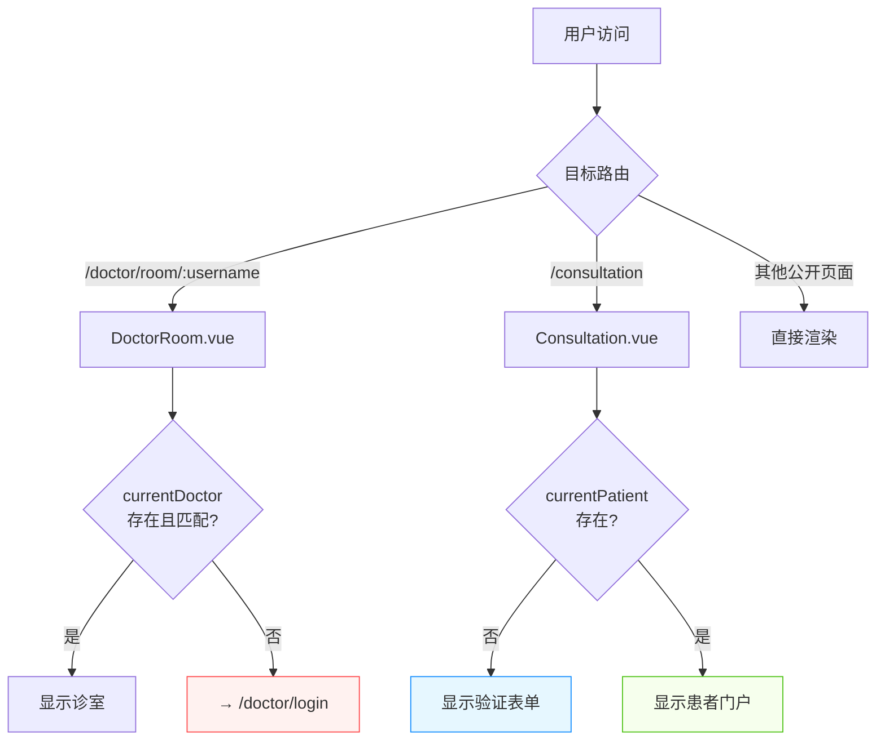
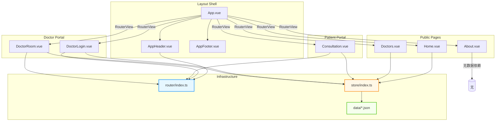
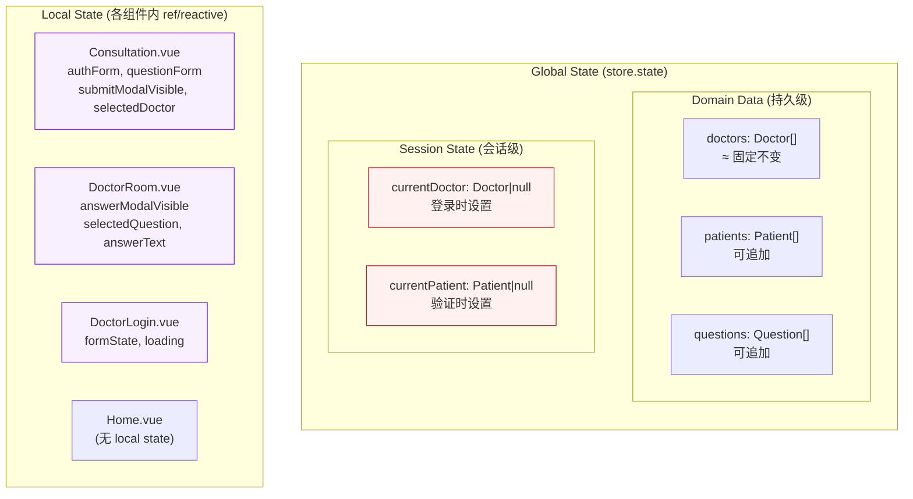
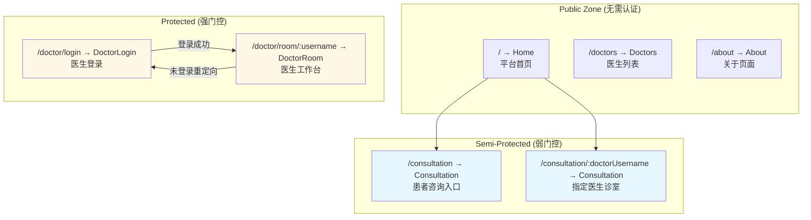

# 系统架构文档 (Architecture)

> **生成时间**: 2026-04-27
> **关联文件**: [`index.md`](index.md) | **语言**: 中文 (zh-CN)

---

## 概述

本文档从**宏观架构视角**描述 QA Live Healthcare 系统的设计决策、技术选型理由、模块交互模式及演进方向。适合需要理解"为什么这样设计"和"如何扩展"的场景。

### 架构定位

```
┌─────────────────────────────────────────────────────┐
│           QA Live Healthcare 架构定位                │
│                                                     │
│   类型: 单页应用 SPA (Single Page Application)      │
│   模式: 前端驱动 (Frontend-Driven / Mock Backend)  │
│   阶段: MVP (Minimum Viable Product)               │
│   规模: 小型项目 (~10 Vue 组件, ~1600 行源码)       │
│   数据: 客户端本地 JSON + 内存状态                   │
│   部署: 静态文件托管 (CDN / 静态服务器)              │
└─────────────────────────────────────────────────────┘
```

---

## 一、技术选型与决策记录

### 1.1 技术栈全景



### 1.2 关键技术决策 (ADR)

#### ADR-001: 选择 Vue 3 Composition API 而非 Options API

| 维度 | 决策 |
|------|------|
| **选择** | `<script setup lang="ts">` + Composition API |
| **替代方案** | Options API（data/methods/computed/watch） |
| **理由** | 更好的 TypeScript 推断、逻辑复用性（composables）、更紧凑的代码组织、Vue 3 官方推荐范式 |
| **影响** | 全部 10 个 SFC 组件统一使用此模式 |

#### ADR-002: 使用 reactive 手写 Store 而非 Pinia/Vuex

| 维度 | 决策 |
|------|------|
| **选择** | `reactive<State>` + 导出 store 对象 |
| **替代方案** | Pinia（Vue 生态推荐）、Vuex 3/4 |
| **理由** | 项目规模小（~12 个方法），引入 Pinia 的收益不足以抵消额外依赖成本；reactive 已满足响应式需求；学习成本低 |
| **风险** | 无 DevTools 支持、无插件生态、无中间件机制 |
| **迁移路径** | 可无缝迁移至 Pinia — 将 state 改为 defineStore，方法保持不变 |

#### ADR-003: 本地 JSON 数据而非 API 后端

| 维度 | 决策 |
|------|------|
| **选择** | `src/data/*.json` + `import` 直接加载 |
| **替代方案** | REST API / GraphQL / Mock Service Worker |
| **理由** | MVP 阶段快速验证产品概念；无需搭建后端环境；数据量小且固定；降低开发复杂度 |
| **局限** | 数据不持久化（刷新丢失动态数据）；无真实网络延迟体验；无法多客户端同步 |
| **演进** | 参见 [api.md](api.md) 第六章的 REST 映射表 |

#### ADR-004: 选择 Ant Design Vue 作为 UI 库

| 维度 | 决策 |
|------|------|
| **选择** | Ant Design Vue 4.x |
| **替代方案** | Element Plus、Naive UI、Vuetify、自建组件库 |
| **理由** | 与 Ant Design 设计语言一致；企业级组件丰富（Form/Table/Modal/Collapse/Badge 等）；中文文档完善；社区活跃 |
| **使用覆盖** | Form + Input + DatePicker + Select + Button + Modal + Card + Alert + Tag + Badge + Collapse + Layout + Menu + Empty 共 14 种组件 |

#### ADR-005: HTML5 History Mode 而非 Hash Mode

| 维度 | 决策 |
|------|------|
| **选择** | `createWebHistory()` — URL 形如 `/consultation/dr-zhang-wei` |
| **替代方案** | `createWebHashHistory()` — URL 形如 `/#/consultation/dr-zhang-wei` |
| **理由** | 更干净的 URL（利于分享诊室链接）；SEO 友好；现代浏览器全面支持 |
| **部署要求** | 服务器需配置 fallback（所有路由指向 index.html） |

---

## 二、架构层次图

### 2.1 四层架构

```
╔══════════════════════════════════════════════════════════╗
║                    表现层 Presentation                    ║
║  ┌──────────┐ ┌──────────┐ ┌──────────┐ ┌──────────┐   ║
║  │ Home.vue │ │Doctors.vu│ │Consult.. │ │DoctorR.. │   ║
║  │About.vue │ │DoctorL.. │ │AppHeader │ │AppFooter │   ║
║  └──────────┘ └──────────┘ └──────────┘ └──────────┘   ║
║     ↓ Template 渲染 ↓  ↓ 用户事件 ↓                       ║
╠══════════════════════════════════════════════════════════╣
║                    路由层 Routing                        ║
║            Vue Router (7 routes, history mode)            ║
║         URL 解析 → 组件匹配 → 参数提取 → 权限守卫          ║
╠══════════════════════════════════════════════════════════╣
║                    业务逻辑层 Business Logic               ║
║  ┌─────────────────────────────────────────────────┐     ║
║  │             Store (src/store/index.ts)            │     ║
║  │                                                  │     ║
║  │  ┌─ State (reactive) ──────────────────────┐    │     ║
║  │  │ doctors[], patients[], questions[]        │    │     ║
║  │  │ currentDoctor, currentPatient             │    │     ║
║  │  └──────────────────────────────────────────┘    │     ║
║  │                                                  │     ║
║  │  ┌─ Methods ────────────────────────────────┐    │     ║
║  │  │ login*, verify*, addQ, answerQ, get*...   │    │     ║
║  │  └──────────────────────────────────────────┘    │     ║
║  └─────────────────────────────────────────────────┘     ║
╠══════════════════════════════════════════════════════════╣
║                     数据层 Data                         ║
║  ┌─────────────┐ ┌─────────────┐ ┌─────────────┐       ║
║  │ doctor-user │ │ patient-user│ │ question-list│       ║
║  │ -list.json  │ │ .json       │ │ .json       │       ║
║  │  (5 records)│ │ (5 records) │ │ (7 records) │       ║
║  └─────────────┘ └─────────────┘ └─────────────┘       ║
╚══════════════════════════════════════════════════════════╝
```

### 2.2 层间依赖规则

| 规则 | 说明 |
|------|------|
| ✅ 允许：表现层 → 路由层 | 通过 `useRouter` / `useRoute` 访问路由信息 |
| ✅ 允许：表现层 → 业务逻辑层 | 直接调用 `store.*` 方法 |
| ❌ 禁止：表现层 → 数据层 | 视图不应直接 `import` JSON，应通过 Store 间接访问 |
| ✅ 允许：业务逻辑层 → 数据层 | Store 在初始化时 import JSON 数据 |
| ❌ 禁止：跨层级跳过 | 如视图绕过 Store 直接操作数据 |

**当前合规情况**：

```
✅ Home.vue          → store.getStatistics() / store.getActiveDoctors()
✅ Doctors.vue       → store.state.doctors
✅ Consultation.vue  → store.verifyPatient() / store.addQuestion() / ...
✅ DoctorLogin.vue   → store.loginDoctor()
✅ DoctorRoom.vue    → store.answerQuestion() / store.getQuestionsByDoctor() / ...
✅ About.vue         → 无数据依赖（纯展示）
✅ AppHeader.vue     → router (路由层)
✅ AppFooter.vue     → 无依赖
✅ store/index.ts    → data/*.json (数据层)
```

全部合规，无不规范的跨层访问。

---

## 三、核心设计模式

### 3.1 单向数据流 (Unidirectional Data Flow)

本项目遵循 Vue 3 推荐的单向数据流模式：



**关键原则**：
1. **State 是唯一数据源** — 所有数据从 `store.state` 派生
2. **View 只读 State** — 组件通过 computed/ref 访问，不直接修改原始数据
3. **修改只能通过 Store 方法** — 所有数据变更封装在 `store.*` 方法中

### 3.2 观察者模式 (Observer Pattern via Reactive)

Vue 3 的 `reactive` 系统基于 Proxy 实现自动依赖追踪：

```
场景示例：医生回答问题后，患者端实时看到状态变化

DoctorRoom.vue:
  store.answerQuestion('q004', '建议做心电图检查...')
      │
      ▼
Store 内部:
  question.status = 'pending' → 'answered'  ← 触发 reactive 通知
  question.answer = null → '建议做心电图...'  ← 触发 reactive 通知
      │
      ▼
Vue 响应系统:
  自动标记所有「读取了该 question 的组件」为脏 (dirty)
  → DoctorRoom.vue 的 pendingQuestions computed 重算（数量 -1）
  → DoctorRoom.vue 的 answeredQuestions computed 重算（数量 +1）
  → Consultation.vue 的 myQuestions computed 重算（显示绿色标签）
      │
      ▼
DOM Update:
  各组件自动 re-render，用户界面同步更新
```

### 3.3 门控模式 (Gate Pattern for Authentication)

系统采用**页面级门控**实现权限控制：



**两种门控对比**：

| 特性 | 医生端（强门控） | 患者端（弱门控） |
|------|------------------|------------------|
| 未认证行为 | 强制重定向到登录页 | 显示身份验证表单 |
| 实现位置 | `onMounted` 生命周期 | `v-if/v-else` 条件渲染 |
| 用户体验 | 中断式（离开当前页） | 页面内切换（同页完成） |

---

## 四、组件通信拓扑

### 4.1 通信方式统计

| 通信方式 | 使用频率 | 典型场景 |
|----------|----------|----------|
| **Props Down** (父子) | 几乎不用 | 仅 App.vue → RouterView（隐式） |
| **Events Up** (子父) | 不使用 | 无自定义 emit 事件 |
| **Store Global** (全局共享) | **主要方式** | 所有跨组件数据共享 |
| **Router Params** (URL 参数) | 少量 | 诊室链接传递医生标识 |
| **Local Ref** (组件内状态) | 常用 | 弹窗开关、表单数据、loading 状态 |

### 4.2 组件依赖关系图



### 4.3 组件耦合度分析

| 组件对 | 耦合类型 | 耦合程度 | 说明 |
|--------|----------|----------|------|
| Views ↔ Store | **数据耦合** | 中 | 通过方法签名契约绑定，接口稳定则低耦合 |
| Views ↔ Router | **控制耦合** | 低 | 仅 useRoute/useRouter，松散绑定 |
| App.vue ↔ Components | **布局耦合** | 低 | 固定结构，变化概率极低 |
| Store ↔ Data | **数据耦合** | 高 | 但仅在初始化时一次性加载，运行时解耦 |
| Views 之间 | **无直接耦合** | **无** | 完全通过 Store/Router 间接通信 |

**结论**：整体架构耦合度健康。唯一的高耦合点（Store↔Data）因是一次性导入而实际影响有限。

---

## 五、状态管理架构详解

### 5.1 状态分域模型



**设计原则**：
- **跨组件共享的数据** → 放入 Global State（Store）
- **仅单个组件使用的数据** → 放入 Local State（组件内 ref/reactive）
- **会话级别的临时状态** → 放入 Session State（Store 但生命周期短）

### 5.2 Local vs Global 边界判定

以 Consultation.vue 为例，展示边界划分：

```typescript
// ══ Global State（来自 Store）══════════════════
const currentPatient = computed(() => store.state.currentPatient);
// 理由：其他组件可能也需要知道当前患者（虽然目前没有）

const myQuestions = computed(() =>
  currentPatient.value ? store.getQuestionsByPatient(currentPatient.value.id) : []
);
// 理由：数据来源于 Store，属于共享数据的派生值

// ══ Local State（仅本组件使用）══════════════════
const authForm = reactive({ name: '', birthday: null });
// 理由：表单输入的中间状态，无需跨组件共享

const submitModalVisible = ref(false);
// 理由：弹窗开关只影响本组件 UI

const selectedDoctor = ref<Doctor | null>(null);
// 理由：预选医生状态仅用于本页面的业务逻辑

const questionForm = reactive({ doctorId: '', question: '' });
// 理由：提交问题的表单数据，提交后就清空

const submitting = ref(false);
// 理由：loading 状态仅控制本组件按钮
```

---

## 六、路由架构

### 6.1 路由设计策略



### 6.2 路由复用模式

`Consultation.vue` 同时服务两个路由：

| 路由 | 区别行为 |
|------|----------|
| `/consultation` | 通用入口，医生下拉可选所有在线医生 |
| `/consultation/:doctorUsername` | 指定医生入口，医生字段锁定 |

**实现方式**：通过 `onMounted` 读取 `route.params.doctorUsername` 进行条件分支：

```typescript
onMounted(() => {
  const doctorUsername = route.params.doctorUsername as string;
  if (doctorUsername) {
    const doctor = store.getDoctorByUsername(doctorUsername);
    if (doctor && doctor.isActive) {
      selectedDoctor.value = doctor;       // 预锁定医生
      questionForm.doctorId = doctor.id;   // 默认选中
    }
  }
});
```

这是一种轻量级的**路由参数驱动的预填充模式**，避免了创建两个独立组件。

---

## 七、构建与部署架构

### 7.1 构建流水线

```
源码 (Source)
    │
    ├── src/*.vue          ──┐
    ├── src/*.ts           ──┤
    ├── src/*.css           ──┤
    ├── src/data/*.json     ──┤
    ├── index.html           ──┤
    └── public/*             ──┤
                              │
    npm run build             ▼
    │
    ├─ Step 1: vue-tsc -b
    │   └── TypeScript 类型检查 (严格模式)
    │       失败则终止
    │
    └─ Step 2: vite build
        │
        ├── @vitejs/plugin-vue
        │   └── 编译 <script setup> 为 render functions
        │   编译 <style scoped> 为 CSS Modules
        │
        ├── Rollup Bundler
        │   ├── Tree-shaking（移除未使用代码）
        │   ├── Code splitting（如需要）
        │   ├── Minification（压缩 JS/CSS）
        │   └── Asset hashing（内容哈希文件名）
        │
        └── Output: dist/
            ├── index.html          （注入 script/link 标签）
            ├── assets/
            │   ├── index-[hash].js  （打包后的 bundle）
            │   └── index-[hash].css （抽取的样式）
            └── vite.svg            （public 目录原样复制）
```

### 7.2 部署架构（目标）

由于是纯静态 SPA，部署极为灵活：

```
                          ┌─────────────┐
                          │  CDN / OSS  │ ← 静态资源加速
                          └──────┬──────┘
                                 │
┌─────────────┐           ┌──────▼──────┐
│ 开发者本地    │ ──push──▶│  Web Server  │
│ npm run build│           │ (Nginx/etc) │
└─────────────┘           └──────┬──────┘
                                 │
                    ┌────────────┼────────────┐
                    ▼            ▼            ▼
              用户浏览器1     用户浏览器2    用户浏览器N
              (单页应用SPA)   (独立实例)     (独立实例)
              (各有自己的     (各有自己的     (各有自己的
               内存状态)       内存状态)       内存状态)
```

**关键特性**：
- **无状态服务器**：服务器只托管静态文件，不处理任何业务逻辑
- **客户端隔离**：每个用户的浏览器维护独立的内存状态（Store）
- **数据不共享**：用户 A 提交的问题，用户 B 无法在另一浏览器看到（除非刷新获取相同 JSON 初始数据）

### 7.3 Nginx 部署配置参考

```nginx
server {
    listen 80;
    server_name qalive.example.com;

    root /var/www/qa-live-healthcare/dist;
    index index.html;

    # 静态资源缓存（带 hash 名的资源可长期缓存）
    location /assets/ {
        expires 1y;
        add_header Cache-Control "public, immutable";
    }

    # SPA Fallback：所有非文件请求返回 index.html
    # 使 Vue Router HTML5 History Mode 正常工作
    location / {
        try_files $uri $uri/ /index.html;
    }
}
```

---

## 八、架构局限性分析

### 8.1 当前限制

| 编号 | 局限 | 影响 | 严重程度 |
|------|------|------|----------|
| L-01 | **无数据持久化** | 刷新页面后新建的患者/问题丢失 | 🔴 高 |
| L-02 | **无真实认证** | 密码明文比对，无 token/session 机制 | 🟡 中 |
| L-03 | **无服务端校验** | 所有校验在前端，可被绕过 | 🟡 中 |
| L-04 | **数据孤岛** | 多浏览器/多设备间数据不同步 | 🟢 低（MVP 可接受） |
| L-05 | **无离线支持** | 断网后无法访问 | 🟢 低 |
| L-06 | **无国际化** | 界面硬编码中文 | 🟢 低 |

### 8.2 扩展路线图

```
Phase 1 (当前 MVP)
├── 纯前端 SPA
├── Mock JSON 数据
├── 内存状态管理
└── 单人开发规模

Phase 2 (产品化)
├── 接入后端 API (REST/GraphQL)
├── 引入 Pinia + 持久化插件
├── JWT Token 认证体系
├── WebSocket 实时消息推送
└── 单元测试 + E2E 测试

Phase 3 (规模化)
├── 微前端拆分（医生端/患者端/管理后台）
├── SSR/SSG (Nuxt 3) 优化 SEO
├── 国际化 i18n
├── PWA 离线支持
├── 监控 & 日志体系
└── CI/CD 自动化部署流水线
```

---

## 九、架构原则总结

| 原则 | 本项目的体现 |
|------|-------------|
| **KISS (Keep It Simple, Stupid)** | 不引入 Pinia，手写 reactive Store；不引入 Axios，无 HTTP 请求 |
| **DRY (Don't Repeat Yourself)** | 类型定义集中在 Store；时间格式化函数各处复用同一 dayjs 格式 |
| **单一职责** | 每个视图组件对应一个路由一个职责；Store 专注数据管理 |
| **关注点分离** | template(视图)/script(逻辑)/style(样式) 三块分离；数据层/业务层/表现层分层 |
| **最小惊讶原则** | 文件命名直观（Doctors.vue 就是医生页面）；API 命名语义化（loginDoctor 就是用医生账号登录） |
| **渐进增强** | 从 MVP 出发，架构预留扩展空间（Store 接口稳定，可替换内部实现） |

---

*此文件由 Context Builder 自动生成，属于 [index.md](index.md) 上下文体系的补充文档。*
