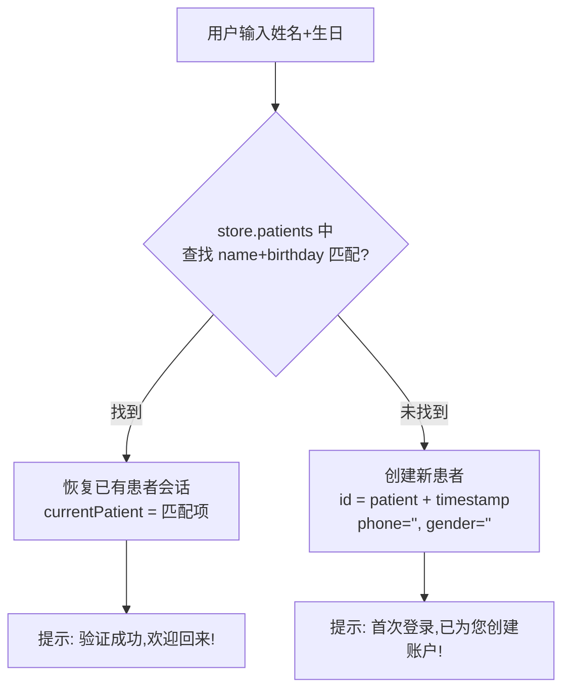
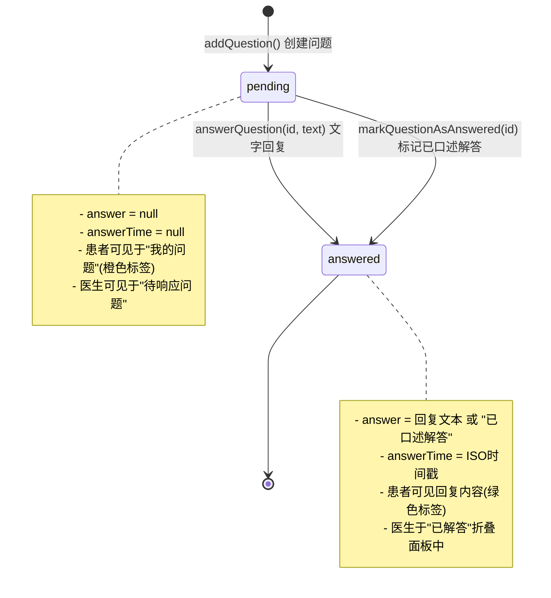
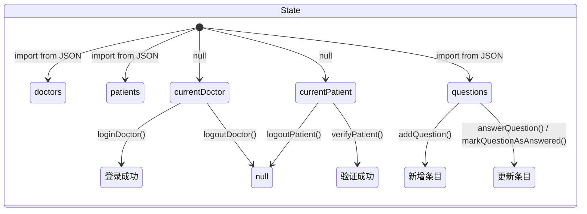
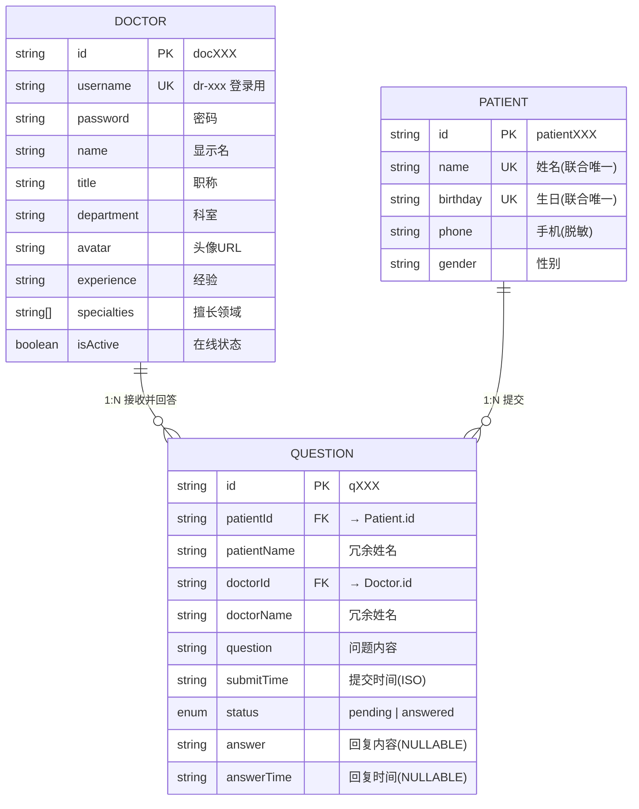

# 数据模型文档 (Data Models)

> **生成时间**: 2026-04-27
> **关联文件**: [`index.md`](index.md) | **语言**: 中文 (zh-CN)

---

## 概述

本文档详细描述 QA Live Healthcare 系统中所有数据实体的结构、约束、关系和数据流。系统采用**本地 JSON 文件 + Vue 3 响应式状态管理**的方案，无后端数据库。

### 数据架构总览

```mermaid
graph TB
    subgraph 数据源层 "数据源层 (JSON Files)"
        DF1["doctor-user-list.json<br/>医生静态数据"]
        DF2["patient-user.json<br/>患者基础数据"]
        DF3["question-list.json<br/>问题历史记录"]
    end

    subgraph 状态管理层 "状态管理层 (Store)"
        S1["reactive&lt;State&gt;"]
        S2["doctors: Doctor[]"]
        S3["patients: Patient[]"]
        S4["questions: Question[]"]
        S5["currentDoctor / currentPatient"]
    end

    subgraph 视图层 "视图层 (Views)"
        V1["Home.vue<br/>统计 + 在线医生"]
        V2["Doctors.vue<br/>全部医生列表"]
        V3["Consultation.vue<br/>患者提问/查看回复"]
        V4["DoctorLogin.vue<br/>登录验证"]
        V5["DoctorRoom.vue<br/>回答/标记问题"]
    end

    DF1 -->|import| S2
    DF2 -->|import| S3
    DF3 -->|import| S4
    S2 & S3 & S4 --> S1
    S1 --> V1 & V2 & V3 & V4 & V5
    V3 -->|addQuestion()| S4
    V5 -->|answerQuestion()<br/>markQuestionAsAnswered()| S4
```

---

## 实体一：Doctor（医生）

### 类型定义

位置：[`src/store/index.ts`](../src/store/index.ts) 第 6-17 行

```typescript
export interface Doctor {
  id: string;            // 医生唯一标识
  username: string;      // 登录用户名（唯一）
  password: string;      // 登录密码
  name: string;          // 显示名称（如"张伟医生"）
  title: string;         // 职称（主任医师/副主任医师/主治医师等）
  department: string;    // 所属科室
  avatar: string;        // 头像 URL
  experience: string;    // 从业经验描述
  specialties: string[]; // 专业擅长领域标签数组
  isActive: boolean;     // 是否在线接诊
}
```

### 字段详细说明

| 字段 | 类型 | 必填 | 说明 | 示例值 | 约束 |
|------|------|------|------|--------|------|
| `id` | `string` | 是 | 主键，唯一标识 | `"doc001"` | 格式：`doc` + 3位序号 |
| `username` | `string` | 是 | 登录用，业务唯一键 | `"dr-zhang-wei"` | 格式：`dr-` + 拼音全名，用于路由参数和登录匹配 |
| `password` | `string` | 是 | 登录密码 | `"123456"` | 明文存储（仅演示环境） |
| `name` | `string` | 是 | 显示名 | `"张伟医生"` | 带"医生"后缀 |
| `title` | `string` | 是 | 职称 | `"主任医师"` | 见下方枚举表 |
| `department` | `string` | 是 | 科室 | `"心内科"` | 见下方科室列表 |
| `avatar` | `string` | 是 | 头像图片地址 | Pexels URL | 外部 HTTPS 链接，约 400px |
| `experience` | `string` | 是 | 经验描述 | `"15年临床经验"` | 自由文本 |
| `specialties` | `string[]` | 是 | 擅长领域标签 | `["高血压","冠心病"]` | 字符串数组，通常 2-3 个标签 |
| `isActive` | `boolean` | 是 | 在线状态 | `true` / `false` | 控制"进入诊室"按钮是否可点击 |

### title 可枚举值

当前系统中出现的职称：

| 职称 | 出现次数 | 对应医生 |
|------|----------|----------|
| 主任医师 | 2 | 张伟医生、刘敏医生 |
| 副主任医师 | 2 | 李娜医生、陈杰医生 |
| 主治医师 | 1 | 王强医生 |

### department 可枚举值（科室）

| 科室 | 在线人数 | 离线人数 |
|------|----------|----------|
| 心内科 | 1 | - |
| 儿科 | 1 | - |
| 骨科 | 1 | - |
| 妇产科 | - | 1 |
| 消化内科 | 1 | - |

### 当前完整数据快照

来源：[`src/data/doctor-user-list.json`](../src/data/doctor-user-list.json)

| id | username | name | title | department | isActive |
|----|----------|------|------|-------------|----------|
| doc001 | dr-zhang-wei | 张伟医生 | 主任医师 | 心内科 | ✅ |
| doc002 | dr-li-na | 李娜医生 | 副主任医师 | 儿科 | ✅ |
| doc003 | dr-wang-qiang | 王强医生 | 主治医师 | 骨科 | ✅ |
| doc004 | dr-liu-min | 刘敏医生 | 主任医师 | 妇产科 | ❌ |
| doc005 | dr-chen-jie | 陈杰医生 | 副主任医师 | 消化内科 | ✅ |

**统计数据**：
- 总计：**5** 位医生
- 在线 (`isActive=true`)：**4** 位 (80%)
- 离线 (`isActive=false`)：**1** 位 (20%)

---

## 实体二：Patient（患者）

### 类型定义

位置：[`src/store/index.ts`](../src/store/index.ts) 第 19-25 行

```typescript
export interface Patient {
  id: string;       // 患者唯一标识
  name: string;     // 姓名（身份验证用）
  birthday: string; // 生日（身份验证用，格式 YYYY-MM-DD）
  phone: string;    // 手机号（脱敏显示）
  gender: string;   // 性别
}
```

### 字段详细说明

| 字段 | 类型 | 必填 | 说明 | 示例值 | 约束 |
|------|------|------|------|--------|------|
| `id` | `string` | 是 | 主键 | `"patient001"` | 格式：`patient` + 3位序号 |
| `name` | `string` | 是 | 姓名 | `"赵明"` | 身份验证字段之一 |
| `birthday` | `string` | 是 | 出生日期 | `"1985-03-15"` | 格式固定为 `YYYY-MM-DD`，与 dayjs DatePicker 配合使用 |
| `phone` | `string` | 否 | 联系电话（脱敏） | `"138****1234"` | 中间四位用 `*` 掩码，非必填 |
| `gender` | `string` | 否 | 性别 | `"男"` / `"女"` | 枚举值 |

### 身份验证机制

患者的登录/注册不依赖 `id`，而是通过 **`name` + `birthday` 的组合** 进行身份识别：



**关键逻辑代码** ([`src/store/index.ts`](../src/store/index.ts) 第 74-92 行)：

```typescript
verifyPatient(name: string, birthday: string): Patient {
  let patient = state.patients.find(
    p => p.name === name && p.birthday === birthday
  );

  if (!patient) {
    patient = {
      id: `patient${Date.now()}`,  // 时间戳生成 ID
      name,
      birthday,
      phone: '',                   // 新建默认空值
      gender: '',
    };
    state.patients.push(patient);  // 动态追加到内存数组
  }

  state.currentPatient = patient;
  return patient;
}
```

### 注意事项

> **⚠️ 数据持久性限制**：新注册的患者通过 `state.patients.push()` 仅添加到**内存中的响应式数组**，页面刷新后会丢失。原始 JSON 文件中的 5 名预置患者不会丢失。

### 当前完整数据快照

来源：[`src/data/patient-user.json`](../src/data/patient-user.json)

| id | name | birthday | phone | gender |
|----|------|----------|-------|--------|
| patient001 | 赵明 | 1985-03-15 | 138****1234 | 男 |
| patient002 | 孙丽 | 1990-07-22 | 139****5678 | 女 |
| patient003 | 周杰 | 1978-11-08 | 137****9012 | 男 |
| patient004 | 吴芳 | 1995-05-20 | 136****3456 | 女 |
| patient005 | 郑浩 | 1988-09-12 | 135****7890 | 男 |

**统计数据**：
- 预置患者：**5** 人
- 性别分布：男 3 人 (60%)，女 2 人 (40%)
- 年龄范围：约 31 岁 ~ 48 岁（基于 2026 年计算）

---

## 实体三：Question（问诊问题）

### 类型定义

位置：[`src/store/index.ts`](../src/store/index.ts) 第 27-38 行

```typescript
export interface Question {
  id: string;                    // 问题唯一标识
  patientId: string;             // 关联患者 ID（外键 → Patient.id）
  patientName: string;           // 冗余存储的患者姓名（用于展示）
  doctorId: string;              // 关联医生 ID（外键 → Doctor.id）
  doctorName: string;            // 冗余存储的医生姓名（用于展示）
  question: string;              // 问题正文内容
  submitTime: string;            // 提交时间（ISO 8601 格式）
  status: 'pending' | 'answered'; // 问题状态枚举
  answer: string | null;         // 医生回复内容（待回复时为 null）
  answerTime: string | null;     // 回复时间（待回复时为 null）
}
```

### 字段详细说明

| 字段 | 类型 | 必填 | 说明 | 示例值 | 约束 |
|------|------|------|------|--------|------|
| `id` | `string` | 是 | 主键 | `"q001"` | 预置格式：`q` + 3位序号；动态生成格式：`q` + timestamp |
| `patientId` | `string` | 是 | 外键 → Patient | `"patient001"` | 关联患者实体 |
| `patientName` | `string` | 是 | 患者姓名冗余 | `"赵明"` | 冗余存储，避免跨表查询 |
| `doctorId` | `string` | 是 | 外键 → Doctor | `"doc001"` | 关联目标医生 |
| `doctorName` | `string` | 是 | 医生姓名冗余 | `"张伟医生"` | 冗余存储 |
| `question` | `string` | 是 | 问题正文 | `"最近总是感觉胸闷气短..."` | 自由文本，由患者输入 |
| `submitTime` | `string` | 是 | 提交时间 | `"2025-11-02T09:30:00"` | ISO 8601，由 `new Date().toISOString()` 自动生成 |
| `status` | `string` | 是 | 状态枚举 | `"pending"` / `"answered"` | 详见下方状态机 |
| `answer` | `string \| null` | 条件 | 回复内容 | 或 `null` | pending 时必须为 null； answered 时有值或为 `"已口述解答"` |
| `answerTime` | `string \| null` | 条件 | 回复时间 | 或 `null` | 由 `new Date().toISOString()` 在回复时自动生成 |

### 问题状态机



### status 枚举值详情

| 值 | 含义 | UI 展示 | 颜色 | answer | answerTime |
|----|------|---------|------|--------|------------|
| `pending` | 待解答 | "待解答" (Tag) | 橙色 (`orange`) | `null` | `null` |
| `answered` | 已解答 | "已解答" (Tag) | 绿色 (`green`) | 回复文本 / `"已口述解答"` | ISO 时间戳 |

### 数据创建流程

#### 创建问题 (addQuestion)

```typescript
// src/store/index.ts 第 106-117 行
addQuestion(data: Omit<Question, 'id' | 'submitTime' | 'status' | 'answer' | 'answerTime'>): Question {
  const newQuestion: Question = {
    ...data,
    id: `q${Date.now()}`,              // 时间戳生成 ID
    submitTime: new Date().toISOString(), // 自动填充提交时间
    status: 'pending',                  // 初始状态
    answer: null,
    answerTime: null,
  };
  state.questions.push(newQuestion);
  return newQuestion;
}
```

**调用方传入的数据**（来自 Consultation.vue）：

```typescript
store.addQuestion({
  patientId: currentPatient.value.id,
  patientName: currentPatient.value.name,
  doctorId: doctor.id,
  doctorName: doctor.name,
  question: questionForm.question,  // 用户输入的问题文本
});
```

#### 回答问题 (answerQuestion)

```typescript
// src/store/index.ts 第 119-126 行
answerQuestion(questionId: string, answer: string) {
  const question = state.questions.find(q => q.id === questionId);
  if (question) {
    question.status = 'answered';
    question.answer = answer;                     // 设置回复内容
    question.answerTime = new Date().toISOString(); // 记录回复时间
  }
}
```

#### 标记已解答 (markQuestionAsAnswered)

```typescript
// src/store/index.ts 第 128-135 行
markQuestionAsAnswered(questionId: string) {
  const question = state.questions.find(q => q.id === questionId);
  if (question) {
    question.status = 'answered';
    question.answer = '已口述解答';               // 固定文本
    question.answerTime = new Date().toISOString();
  }
}
```

### 当前完整数据快照

来源：[`src/data/question-list.json`](../src/data/question-list.json)

| id | patientName | doctorName | question 摘要 | status | answer 摘要 |
|----|------------|------------|--------------|--------|------------|
| q001 | 赵明 | 张伟医生 | 最近总是感觉胸闷气短... | ✅ answered | 建议做个心电图和心脏彩超... |
| q002 | 孙丽 | 李娜医生 | 孩子5岁,最近总是咳嗽... | ⏳ pending | - |
| q003 | 周杰 | 王强医生 | 打篮球时扭伤了脚踝... | ✅ answered | 立即冰敷,抬高患肢... |
| q004 | 赵明 | 张伟医生 | 血压最近有点高... | ⏳ pending | - |
| q005 | 吴芳 | 陈杰医生 | 经常胃痛,吃完饭后更明显... | ⏳ pending | - |
| q006 | 郑浩 | 张伟医生 | 体检发现心律不齐... | ⏳ pending | - |
| q007 | 孙丽 | 李娜医生 | 宝宝6个月,可以开始添加辅食了吗? | ✅ answered | 6个月可以开始添加辅食了... |

**统计数据**：
- 总计：**7** 条问题
- 已解答：**3** 条 (42.9%)
- 待响应：**4** 条 (57.1%)
- 最活跃医生：张伟医生（3 条问题），李娜医生（2 条）

---

## 实体四：State（全局状态容器）

### 类型定义

位置：[`src/store/index.ts`](../src/store/index.ts) 第 40-46 行

```typescript
interface State {
  doctors: Doctor[];              // 全部医生列表
  patients: Patient[];            // 全部患者列表（含动态新增）
  questions: Question[];          // 全部问题列表（含动态新增）
  currentDoctor: Doctor | null;   // 当前登录医生（会话级别）
  currentPatient: Patient | null; // 当前验证通过的患者（会话级别）
}
```

### 初始化过程

```typescript
// src/store/index.ts 第 48-54 行
const state = reactive<State>({
  doctors: doctorData as Doctor[],      // 从 JSON 导入
  patients: patientData as Patient[],   // 从 JSON 导入
  questions: questionData as Question[],// 从 JSON 导入
  currentDoctor: null,                  // 无默认值
  currentPatient: null,                 // 无默认值
});
```

### 状态流转图



### 会话级 vs 持久级字段

| 级别 | 字段 | 生命周期 | 页面刷新后 |
|------|------|----------|-----------|
| **持久级** | `doctors` | 应用启动时从 JSON 加载 | ✅ 保留（从源文件重新加载） |
| **持久级** | `patients`（预置部分） | 同上 | ✅ 保留 |
| **持久级** | `questions`（预置部分） | 同上 | ✅ 保留 |
| **会话级** | `currentDoctor` | 登录后设置 | ❌ 重置为 `null` |
| **会话级** | `currentPatient` | 验证后设置 | ❌ 重置为 `null` |
| **动态级** | `patients`（新建部分） | verifyPatient 时追加 | ❌ 丢失 |
| **动态级** | `questions`（新建部分） | addQuestion 时追加 | ❌ 丢失 |

---

## 实体关系图 (ER Diagram)



### 关系说明

| 关系 | 类型 | 外键字段 | 级联行为 |
|------|------|----------|----------|
| Doctor → Question | 一对多 (1:N) | `Question.doctorId` | 删除医生时其关联问题保留（软引用） |
| Patient → Question | 一对多 (1:N) | `Question.patientId` | 删除患者时其关联问题保留（软引用） |

> **设计特点**：Question 表采用**冗余存储**模式（`patientName`、`doctorName`），避免在渲染时进行 JOIN 查找。这是前端轻量级数据管理的常见优化策略。

---

## 各视图与数据交互映射

### 数据读取依赖矩阵

| 视图组件 | 读取数据 | 写入操作 | 涉及 Store 方法 |
|----------|----------|----------|-----------------|
| [`Home.vue`](../src/views/Home.vue) | `getStatistics()`, `getActiveDoctors()` | 无 | 统计读取 |
| [`Doctors.vue`](../src/views/Doctors.vue) | `state.doctors` | 无 | 直接访问状态 |
| [`Consultation.vue`](../src/views/Consultation.vue) | `currentPatient`, `getQuestionsByPatient()`, `getActiveDoctors()`, `getDoctorByUsername()` | `verifyPatient()`, `logoutPatient()`, `addQuestion()` | 患者 CRUD |
| [`DoctorLogin.vue`](../src/views/DoctorLogin.vue) | 无 | `loginDoctor()` | 医生认证 |
| [`DoctorRoom.vue`](../src/views/DoctorRoom.vue) | `currentDoctor`, `getQuestionsByDoctor()` (×2) | `logoutDoctor()`, `answerQuestion()`, `markQuestionAsAnswered()` | 医生工作台 |
| [`About.vue`](../src/views/About.vue) | 无 | 无 | 纯静态页 |

### 数据流向图

```mermaid
flowchart LR
    subgraph 读取流 "READ FLOW (虚线)"
        direction LR
        R1[Store] -.->|statistics| H[Home]
        R1 -.->|activeDoctors| H
        R1 -.->|allDoctors| D[Doctors]
        R1 -.->|currentPatient<br/>myQuestions<br/>availableDoctors| C[Consultation]
        R1 -.->|currentDoctor<br/>pendingQuestions<br/>answeredQuestions| DR[DoctorRoom]
    end

    subgraph 写入流 "WRITE FLOW (实线)"
        direction LR
        C -->|verifyPatient| W1[Store: patients.push]
        C -->|addQuestion| W2[Store: questions.push]
        DL[DoctorLogin] -->|loginDoctor| W3[Store: currentDoctor]
        DR -->|answerQuestion<br/>markQuestionAsAnswered| W4[Store: question.update]
        C -->|logoutPatient| W5[Store: currentPatient=null]
        DR -->|logoutDoctor| W6[Store: currentDoctor=null]
    end
```

---

## 枚举与常量汇总

### 职称枚举 (Doctor.title)

```typescript
type DoctorTitle = '主任医师' | '副主任医师' | '主治医师';
```

### 科室枚举 (Doctor.department)

```typescript
type Department = '心内科' | '儿科' | '骨科' | '妇产科' | '消化内科';
```

### 问题状态枚举 (Question.status)

```typescript
type QuestionStatus = 'pending' | 'answered';
```

### 性别枚举 (Patient.gender)

```typescript
type Gender = '男' | '女';
```

### ID 生成规则

| 实体 | 预置数据格式 | 运行时动态格式 |
|------|-------------|---------------|
| Doctor | `doc` + 3位数字（如 `doc001`） | 不支持运行时创建 |
| Patient | `patient` + 3位数字（如 `patient001`） | `patient` + `Date.now()` 时间戳 |
| Question | `q` + 3位数字（如 `q001`） | `q` + `Date.now()` 时间戳 |

### 时间格式约定

| 场景 | 存储格式 | 展示格式 | 格式化方式 |
|------|----------|----------|-----------|
| 数据存储 (submitTime/answerTime) | ISO 8601 | - | `new Date().toISOString()` |
| 前端展示 | - | `YYYY-MM-DD HH:mm` | `dayjs(time).format('YYYY-MM-DD HH:mm')` |
| 日期选择器 (birthday) | Dayjs 对象 → `YYYY-MM-DD` | `YYYY-MM-DD` | Ant Design DatePicker + `dayjs.format('YYYY-MM-DD')` |

---

## 数据文件路径索引

| 文件路径 | 内容 | 大小 | 是否运行时可写 |
|----------|------|------|---------------|
| [`src/data/doctor-user-list.json`](../src/data/doctor-user-list.json) | 5 条医生记录 | ~1.2KB | ❌ 仅读 |
| [`src/data/patient-user.json`](../src/data/patient-user.json) | 5 条患者记录 | ~0.5KB | ❌ 仅读（但 Store 内存可追加） |
| [`src/data/question-list.json`](../src/data/question-list.json) | 7 条问题记录 | ~1.8KB | ❌ 仅读（但 Store 内存可追加） |

---

*此文件由 Context Builder 自动生成，属于 [index.md](index.md) 上下文体系的补充文档。*
