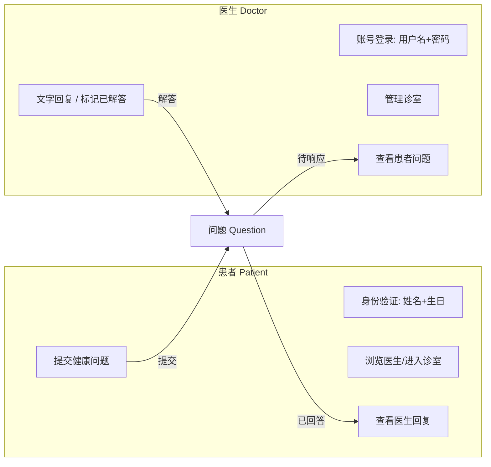
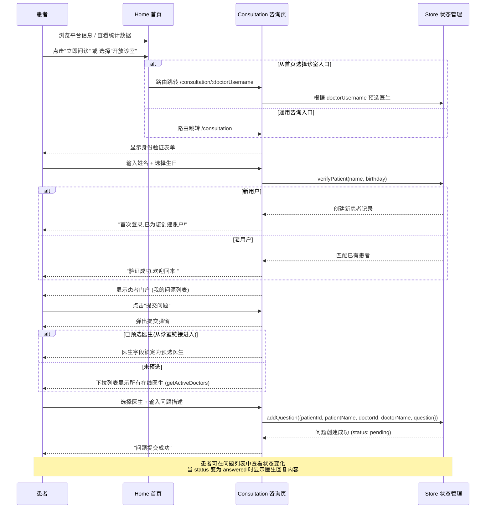
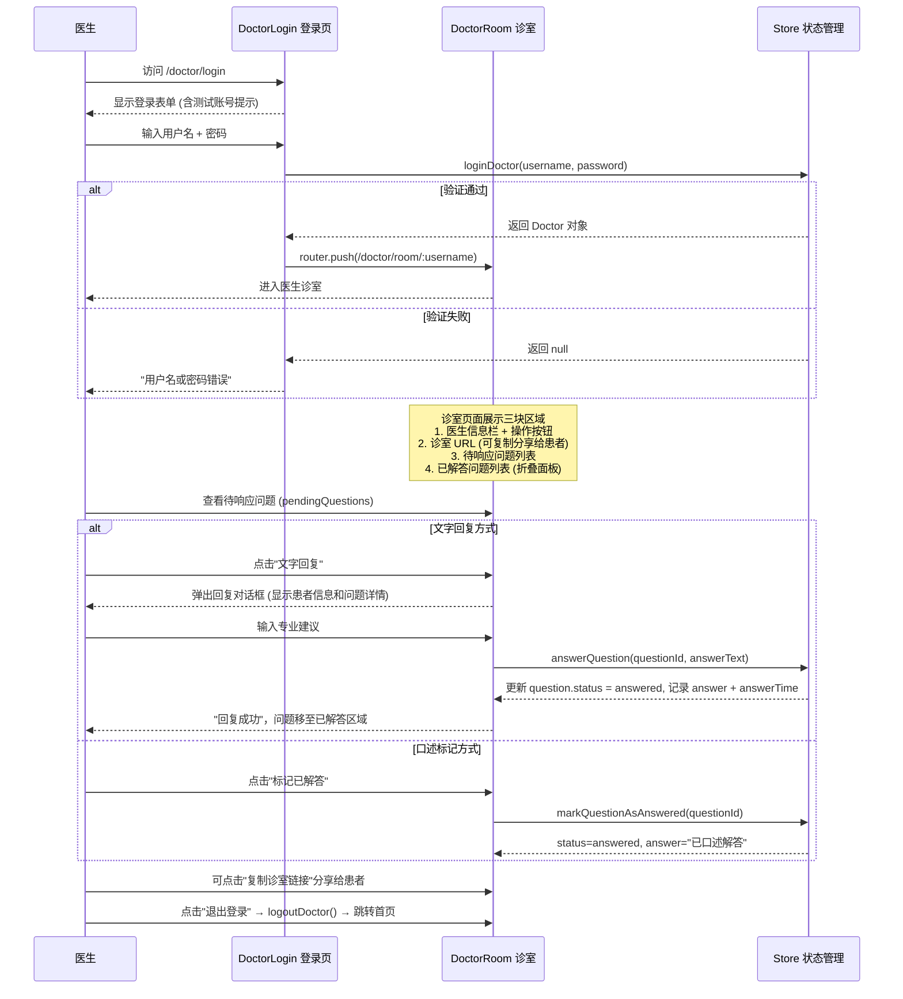
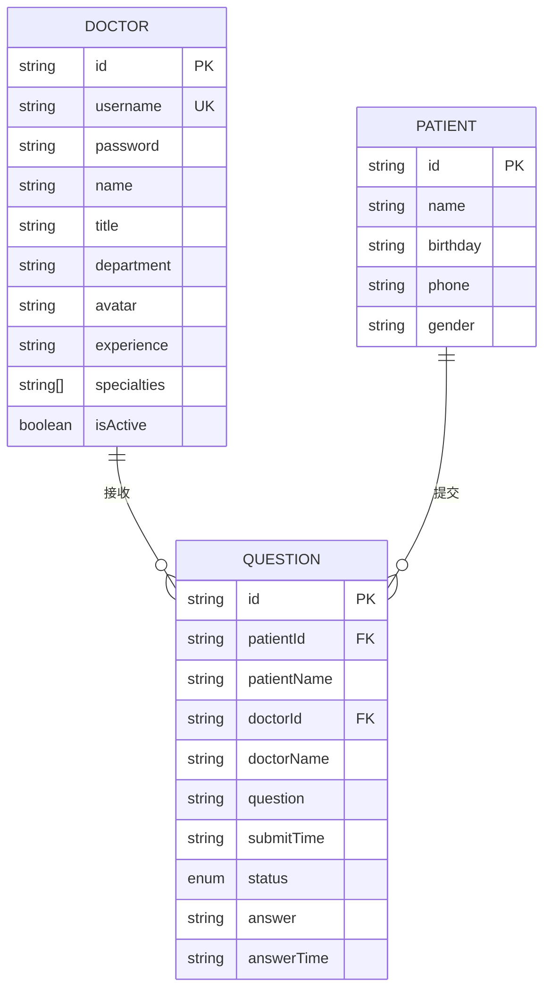

# QA Live Healthcare - 工作区索引

> **生成时间**: 2026-04-27
> **语言**: 中文 (zh-CN)
> **Context Builder 版本**: context-builder

---

## 项目概述

**项目名称**: QA Live Healthcare（在线医疗问询平台）

这是一个基于 Vue 3 + TypeScript + Vite 构建的在线医疗咨询平台，支持患者向医生提问、医生实时答疑等核心功能。前端采用 Ant Design Vue 作为 UI 组件库，使用自定义响应式状态管理方案存储数据。

### 技术栈

| 技术 | 版本 | 用途 |
|------|------|------|
| Vue 3 | ^3.5.10 | 前端框架 (Composition API / script setup) |
| TypeScript | ^5.5.3 | 类型安全 |
| Vite | ^5.4.8 | 构建开发服务器 |
| Vue Router | ^4.6.3 | 客户端路由 |
| Ant Design Vue | ^4.2.6 | UI 组件库 |
| dayjs | ^1.11.19 | 日期处理 |

### 核心功能

- **首页展示** - 平台介绍与导航入口
- **医生列表** - 展示在线医生信息，支持按科室筛选
- **患者咨询** - 患者可向指定医生提交问题
- **医生登录/诊室** - 医生登录后查看并回答患者问题
- **关于页面** - 平台相关信息说明

---

## 业务逻辑详解

### 系统角色与用户体系

系统定义了**两类用户角色**：



#### 患者端业务规则

| 规则 | 描述 |
|------|------|
| **身份验证方式** | 通过「姓名 + 生日（YYYY-MM-DD）」组合进行轻量级身份验证 |
| **自动注册** | 首次输入姓名+生日时，系统自动创建新患者账户 |
| **重复登录** | 相同姓名+生日组合视为同一用户，直接恢复会话 |
| **数据来源** | 患者数据存储于 `src/data/patient-user.json`，运行时可动态新增 |
| **会话状态** | 登录后 `store.state.currentPatient` 持有当前患者信息 |

#### 医生端业务规则

| 规则 | 描述 |
|------|------|
| **登录凭证** | 用户名 + 密码（预设账号见 `src/data/doctor-user-list.json`） |
| **测试账号** | 用户名 `dr-zhang-wei`，密码 `123456` |
| **在线状态** | 由 `Doctor.isActive` 字段控制，仅在线医生的诊室可接受患者提问 |
| **会话守卫** | 医生诊室页面 (`DoctorRoom.vue`) 在 `onMounted` 中校验：若未登录或用户名不匹配则重定向至 `/doctor/login` |

### 完整用户流程

#### 流程一：患者问诊流程



**关键业务细节**：
1. 咨询页面同时处理两种路由场景：通用入口 `/consultation` 和指定医生入口 `/consultation/:doctorUsername`
2. 当从指定医生入口进入时，`onMounted` 会根据路由参数预锁医生选择，患者只能向该医生提问
3. 提交问题时使用 `setTimeout` 模拟 500ms 异步延迟
4. 时间格式化统一使用 dayjs 的 `YYYY-MM-DD HH:mm` 格式

#### 流程二：医生工作流程



**关键业务细节**：
1. 医生有两种回复模式：「文字回复」（需输入具体回复内容）和「标记已解答」（用于口述/线下已答复的场景）
2. 诊室 URL 格式为 `{origin}/consultation/{doctorUsername}`，可分享给患者直达该医生诊室
3. `onMounted` 权限校验确保未登录医生无法直接访问诊室
4. 已解答问题使用 Ant Design Vue Collapse 折叠面板展示，节省空间

### 页面级业务行为说明

#### Home.vue - 首页

| 功能模块 | 业务行为 |
|----------|----------|
| **Hero 区域** | 展示平台标语和三个特性标签，提供"立即问诊"(→/consultation) 和"查看医生"(→/doctors) 入口按钮 |
| **统计卡片** | 调用 `store.getStatistics()` 动态展示：专业医生数、问题总数、待响应问题数、在线诊室数 |
| **开放诊室列表** | 调用 `store.getActiveDoctors()` 仅展示 `isActive=true` 的医生；每张卡片点击后路由到 `/consultation/{username}` |

#### Doctors.vue - 医生列表

| 功能模块 | 业务行为 |
|----------|----------|
| **医生网格展示** | 展示全部医生 (`store.state.doctors`)，不区分在线/离线 |
| **在线标识** | 使用 Ant Design Badge 组件：`processing`(绿色脉冲)=在线, `default`=离线 |
| **卡片交互** | 在线医生卡片有绿色边框高亮 (`.active` class)；离线医生的"进入诊室"按钮置灰禁用 (`disabled`) |
| **操作入口** | 点击"进入诊室"按钮 → 路由至 `/consultation/{doctor.username}` |

#### Consultation.vue - 患者咨询页

这是系统中**业务最复杂**的视图，承担以下职责：

| 状态 | UI 展示 | 允许操作 |
|------|---------|----------|
| **未验证** | 居中身份验证表单（姓名输入框 + 日期选择器） | 填写并提交验证 |
| **已验证（无预选医生）** | 患者门户头部 + 我的问题列表 | 提交问题(可选任意在线医生)、切换用户 |
| **已验证（有预选医生）** | 同上 + 绿色提示条"当前诊室: xxx" | 提交问题(医生锁定)、清除预选医生 |

**表单验证规则**：
- 姓名：必填
- 生日：必填，格式 YYYY-MM-DD（Ant Design DatePicker）

#### DoctorLogin.vue - 医生登录页

| 功能模块 | 业务行为 |
|----------|----------|
| **表单验证** | 用户名和密码均必填 |
| **登录逻辑** | 调用 `store.loginDoctor()`，在 doctors 数组中查找 username + password 匹配的记录 |
| **登录后跳转** | 成功后 `router.push('/doctor/room/' + doctor.username)` |
| **测试账号提示** | 页面底部 Info Alert 显示测试账号：`dr-zhang-wei / 123456` |
| **防抖处理** | 登录操作模拟 500ms loading 延迟 |

#### DoctorRoom.vue - 医生诊室

| 功能模块 | 业务行为 |
|----------|----------|
| **权限守卫** | `onMounted` 检查 `currentDoctor` 是否存在且与路由参数匹配，否则重定向至 `/doctor/login` |
| **待响应问题** | 筛选 `status === 'pending'` 且属于当前医生的问题，每题提供「文字回复」和「标记已解答」两个操作 |
| **已解答问题** | 筛选 `status === 'answered'` 的问题，以折叠面板形式展示（header 截取问题前50字 + 省略号） |
| **回复弹窗** | 显示患者名、原始问题内容、文本输入区，提交后调用 `answerQuestion()` |
| **URL 分享** | 复制 `{origin}/consultation/{username}` 到剪贴板，供医生发送给患者 |

#### About.vue - 关于页面

纯静态展示页，包含四个区块：
- **平台简介** - 文字描述
- **平台特色** - 四张特色卡（专业团队/实时问诊/隐私保护/便捷易用）
- **服务流程** - 四步骤流程图（选择医生→提交问题→医生解答→查看回复）
- **联系我们** - 客服热线/电子邮箱/服务时间

---

## 目录结构

```
qa-live-healthcare/
├── public/                 # 静态资源
├── src/
│   ├── assets/            # 资源文件
│   ├── components/        # 可复用组件
│   │   ├── AppHeader.vue  # 全局页头
│   │   ├── AppFooter.vue  # 全局页脚
│   │   └── HelloWorld.vue # 示例组件
│   ├── data/              # 本地 JSON 数据
│   │   ├── doctor-user-list.json    # 医生用户数据
│   │   ├── patient-user.json        # 患者用户数据
│   │   └── question-list.json       # 问题列表数据
│   ├── router/            # 路由配置
│   │   └── index.ts       # 路由定义
│   ├── store/             # 状态管理
│   │   └── index.ts       # 响应式状态 store
│   ├── views/             # 页面视图
│   │   ├── Home.vue               # 首页
│   │   ├── Doctors.vue            # 医生列表
│   │   ├── Consultation.vue       # 咨询页面
│   │   ├── DoctorLogin.vue        # 医生登录
│   │   ├── DoctorRoom.vue         # 医生诊室
│   │   └── About.vue              # 关于页面
│   ├── App.vue            # 根组件
│   ├── main.ts            # 应用入口
│   └── style.css          # 全局样式
├── index.html             # HTML 入口
├── package.json           # 项目配置
├── vite.config.ts         # Vite 配置
└── tsconfig.json          # TypeScript 配置
```

---

## 路由结构

```mermaid
graph TD
    A[/ 首页 Home] --> B[/consultation 咨询]
    A --> C[/doctors 医生列表]
    A --> D[/about 关于]
    B --> E[/:doctorUsername 指定医生咨询]
    A --> F[/doctor/login 医生登录]
    F --> G[/doctor/room/:username 医生诊室]
```

| 路径 | 名称 | 组件 | 说明 |
|------|------|------|------|
| `/` | Home | `Home.vue` | 平台首页 |
| `/consultation` | Consultation | `Consultation.vue` | 患者咨询入口 |
| `/consultation/:doctorUsername` | ConsultationRoom | `Consultation.vue` | 向指定医生提问 |
| `/doctors` | Doctors | `Doctors.vue` | 在线医生列表 |
| `/about` | About | `About.vue` | 关于平台 |
| `/doctor/login` | DoctorLogin | `DoctorLogin.vue` | 医生登录页 |
| `/doctor/room/:username` | DoctorRoom | `DoctorRoom.vue` | 医生工作台 |

---

## 数据模型

### 核心实体关系



### 类型定义位置

所有接口定义位于 [`src/store/index.ts`](../src/store/index.ts)：
- `Doctor` - 医生信息
- `Patient` - 患者信息
- `Question` - 问题记录

---

## 状态管理架构

本项目使用 Vue 3 `reactive` API 实现轻量级状态管理（非 Pinia/Vuex）：

**Store 位置**: [`src/store/index.ts`](../src/store/index.ts)

**核心功能方法**:

| 方法 | 说明 |
|------|------|
| `loginDoctor(username, password)` | 医生登录验证 |
| `logoutDoctor()` | 医生登出 |
| `verifyPatient(name, birthday)` | 患者身份验证/注册 |
| `logoutPatient()` | 患者登出 |
| `getQuestionsByDoctor(doctorId)` | 获取医生的问题列表 |
| `getQuestionsByPatient(patientId)` | 获取患者的问题列表 |
| `addQuestion(questionData)` | 提交新问题 |
| `answerQuestion(questionId, answer)` | 回答问题 |
| `getActiveDoctors()` | 获取在线医生列表 |
| `getStatistics()` | 获取平台统计数据 |

**响应式状态字段**:
- `state.doctors` - 医生列表
- `state.patients` - 患者列表
- `state.questions` - 问题列表
- `state.currentDoctor` - 当前登录医生
- `state.currentPatient` - 当前登录患者

---

## 关键源码链接

| 文件 | 说明 |
|------|------|
| [`src/main.ts`](../src/main.ts) | 应用入口 - 注册 Antd 和 Router |
| [`src/App.vue`](../src/App.vue) | 根组件 - Header/Layout/Footer 结构 |
| [`src/router/index.ts`](../src/router/index.ts) | 路由配置 |
| [`src/store/index.ts`](../src/store/index.ts) | 状态管理与类型定义 |
| [`src/views/Home.vue`](../src/views/Home.vue) | 首页视图 |
| [`src/views/Doctors.vue`](../src/views/Doctors.vue) | 医生列表视图 |
| [`src/views/Consultation.vue`](../src/views/Consultation.vue) | 患者咨询视图 |
| [`src/views/DoctorLogin.vue`](../src/views/DoctorLogin.vue) | 医生登录视图 |
| [`src/views/DoctorRoom.vue`](../src/views/DoctorRoom.vue) | 医生诊室视图 |
| [`src/components/AppHeader.vue`](../src/components/AppHeader.vue) | 页头导航组件 |
| [`src/components/AppFooter.vue`](../src/components/AppFooter.vue) | 页脚组件 |

---

## 可用的上下文文件

以下上下文文件可按需生成：

| 文件名 | 内容描述 | 状态 |
|--------|----------|------|
| [index.md](index.md) ✓ | 工作区索引与指南 | ✅ 已生成 |
| [standard-project-structure.md](standard-project-structure.md) | 标准化项目结构详解 | ✅ 已生成 |
| [standard-coding-style.md](standard-coding-style.md) | 编码规范与风格指南 | ✅ 已生成 |
| [data-models.md](data-models.md) | 完整数据模型文档 | ✅ 已生成 |
| [deployment.md](deployment.md) | 部署配置与流程 | ✅ 已生成 |
| [api.md](api.md) | API 定义与文档 | ✅ 已生成 |
| [architecture.md](architecture.md) | 系统架构与设计决策 | ✅ 已生成 |

---

## 开发命令

```bash
# 安装依赖
npm install

# 启动开发服务器
npm run dev

# 构建生产版本
npm run build

# 预览生产构建
npm run preview
```

---

*此文件由 Context Builder 自动生成，用于为 AI 模型提供工作区上下文。*
