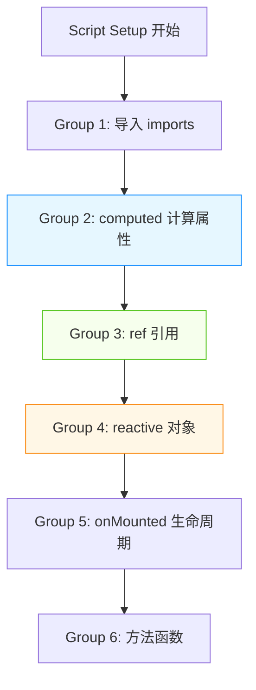

# 代码风格标准文档 (Standard Coding Style)

> **生成时间**: 2026-04-27
> **关联文件**: [`index.md`](index.md) | **语言**: 中文 (zh-CN)

---

## 概述

本文档定义 QA Live Healthcare 项目中所有源码应遵循的**编码风格规范**。基于对现有代码库的系统性分析提炼而成，涵盖 Vue SFC 结构、TypeScript 写法、CSS 规范、命名约定等维度。

### 分析基准

本文档的规范均**提取自项目现有代码的实际模式**，非凭空设定。以下为分析覆盖范围：

| 维度 | 分析样本 |
|------|----------|
| Vue SFC 组件 | 全部 10 个 `.vue` 文件 |
| TypeScript 逻辑文件 | 全部 4 个 `.ts` 文件 |
| 样式定义 | 9 个 `<style scoped>` 块 + 1 个全局 CSS 文件 |
| 导入/导出模式 | 全部 `import`/`export` 语句（19+ 处） |
| 函数/变量声明 | 全部响应式引用和函数定义（33+ 处） |

---

## 一、Vue 单文件组件 (SFC) 结构规范

### 1.1 标准模板

所有 `.vue` 文件必须严格遵循以下三块顺序：

```vue
<!-- ══════════════════════════════════════ -->
<!-- 第一块：<template>                    -->
<!-- ══════════════════════════════════════ -->
<template>
  <!-- 模板内容 -->
</template>

<!-- ══════════════════════════════════════ -->
<!-- 第二块：<script setup lang="ts">       -->
<!-- ══════════════════════════════════════ -->
<script setup lang="ts">
// 脚本逻辑
</script>

<!-- ══════════════════════════════════════ -->
<!-- 第三块：<style scoped>                 -->
<!-- ══════════════════════════════════════ -->
<style scoped>
/* 组件样式 */
</style>
```

**强制规则**：

| 规则 | 说明 | 当前合规率 |
|------|------|-----------|
| 必须使用 `<script setup>` 语法糖 | 禁用 Options API 或普通 `<script setup>`（无 `lang="ts"`） | ✅ 100% (10/10) |
| `lang` 属性必须为 `"ts"` | 启用 TypeScript 支持 | ✅ 100% (10/10) |
| 三块顺序不可颠倒 | template → script → style | ✅ 100% (10/10) |
| style 必须加 `scoped` | 防止样式污染全局 | ✅ 100% (10/10) |
| 块之间空一行分隔 | 保持视觉清晰度 | ✅ 100% (10/10) |

### 1.2 Script 块内部组织

#### 导入区（Import Section）

导入语句按以下**分组顺序**排列，组间空一行：

```typescript
// ══ 第一组：Vue 核心 API ═════════════
import { ref, reactive, computed, onMounted } from 'vue';
import { useRouter, useRoute } from 'vue-router';

// ══ 第二组：第三方 UI 库 ═════════════
import { message } from 'ant-design-vue';
import dayjs, { Dayjs } from 'dayjs';
import {
  CheckCircleOutlined,
  TeamOutlined,
  FileTextOutlined,
} from '@ant-design/icons-vue';

// ══ 第三组：内部模块 ═════════════
import { store, Doctor, Question } from '../store';
```

**详细规则**：

| 规则 | 示例 | 备注 |
|------|------|------|
| Vue API 在最前 | `import { ref, computed } from 'vue'` | 含 vue-router |
| 第三方库其次 | Ant Design、dayjs 等 | 按字母排序更佳 |
| 内部模块最后 | Store、组件、数据 | 使用相对路径 |
| 图标多行时换行 | `{ IconA,\n  IconB }` | 超过 3 个图标时换行 |
| JSON 直接导入无特殊处理 | `import data from './data.json'` | 放在内部模块组 |

#### 变量声明区（Declaration Section）

变量按**响应式类型分组**，排列顺序：

```typescript
// ── 1. computed 计算属性 ──────────────
const currentDoctor = computed(() => store.state.currentDoctor);
const pendingQuestions = computed(() => /* ... */);

// ── 2. ref 响应式引用 ─────────────────
const answerModalVisible = ref(false);
const selectedQuestion = ref<Question | null>(null);
const submitting = ref(false);

// ── 3. reactive 响应式对象 ────────────
const formState = reactive({
  username: '',
  password: '',
});

const authForm = reactive({
  name: '',
  birthday: null as Dayjs | null,
});
```

**规则总结**：



#### 方法定义区（Methods Section）

方法按**功能逻辑分组**，使用箭头函数：

```typescript
// ── 生命周期钩子 ─────────────────────
onMounted(() => {
  // 初始化逻辑
});

// ── 用户交互方法 ──────────────────────
const navigateTo = (path: string) => { /* ... */ };
const logout = () => { /* ... */ };

// ── 业务操作方法 ──────────────────────
const submitAnswer = () => { /* ... */ };
const markAsAnswered = (questionId: string) => { /* ... */ };

// ── 辅助工具方法 ──────────────────────
const formatTime = (time: string) => dayjs(time).format('YYYY-MM-DD HH:mm');
```

**函数风格**：
- ✅ **统一使用箭头函数** (`const fn = () => {}`) — 100% 合规
- ✅ 不使用 `function` 关键字声明
- ✅ 不使用 `async/await`（当前代码中仅 `DoctorLogin.vue` 的 `onFinish` 用了 async）

### 1.3 Template 块编写规范

#### 缩进与格式

```vue
<template>
  <div class="container">              <!-- 2 空格缩进 -->
    <div v-if="condition" class="inner">
      <component-name                  <!-- 属性换行时子元素缩进 -->
        :prop="value"
        @event="handler"
      />
      <!-- 条件渲染 / 列表渲染 -->
      <div v-for="item in list" :key="item.id">
        {{ item.name }}
      </div>
    </div>
  </div>
</template>
```

**关键规则**：

| 规则 | 正确示例 | 错误示例 |
|------|----------|----------|
| 根元素单一 | `<div class="page">...</div>` | 多根节点（Vue 3 允许但不推荐在此项目中使用） |
| 类名使用 kebab-case | `class="doctor-card"` | `class="doctorCard"` |
| 绑定属性简写 | `:value="data"` | `v-bind:value="data"` |
| 事件绑定简写 | `@click="handler"` | `v-on:click="handler"` |
| key 属性必写 | `v-for="item in list" :key="item.id"` | 缺少 `:key` |
| 条件/列表指令在属性前 | `v-if="show" class="box"` | `class="box" v-if="show"` |

#### 模板表达式复杂度限制

- ✅ 简单三元表达式：`{{ doctor.isActive ? '在线' : '离线' }}`
- ✅ 简单模板字符串：`\`当前诊室: ${selectedDoctor.name}\``
- ❌ 避免在模板中写复杂逻辑：应抽取为 computed 或方法

---

## 二、TypeScript 编码规范

### 2.1 类型标注风格

#### 基本类型标注

```typescript
// ✓ 明确标注基本类型
const loading = ref(false);
const submitting = ref(false);

// ✓ 泛型标注
const currentPatient = computed(() => store.state.currentPatient);           // 推断类型
const allDoctors = computed(() => store.state.doctors);                     // 推断类型

// ✓ 显式泛型（需要时）
const selectedQuestion = ref<Question | null>(null);
const selectedKeys = ref<string[]>(['home']);
const authForm = reactive({
  name: '',
  birthday: null as Dayjs | null,   // 类型断言用于联合类型
});
```

#### 函数参数与返回值

```typescript
// ✓ 箭头函数 + 参数类型 + 推断返回类型
const navigateTo = (path: string) => {
  router.push(path);
};

// ✓ 有返回值的计算属性
const statistics = computed(() => store.getStatistics());     // 返回推断
const roomUrl = computed(() => `${window.location.origin}/consultation/${username}`);

// ✓ 多行函数体
const verifyPatient = () => {
  const birthday = authForm.birthday?.format('YYYY-MM-DD');
  if (!birthday) {
    message.error('请选择生日');         // 使用 message 反馈
    return;                              // early return 模式
  }
  // ...
};
```

### 2.2 Interface 定义规范

接口定义统一放在数据所属模块中（本项目集中在 `store/index.ts`）：

```typescript
// ✓ PascalCase 命名
export interface Doctor {          // 实体名用单数
  id: string;
  username: string;
  // ...
}

export interface Patient {
  id: string;
  name: string;
  // ...
}

export interface Question {
  id: string;
  status: 'pending' | 'answered';   // 字面量联合类型用于枚举
  answer: string | null;            // 可空字段用联合类型
}
```

### 2.3 Store 对象结构规范

Store 采用**对象字面量 + 方法导出**模式：

```typescript
// ✓ 推荐模式（本项目采用）
export const store = {
  state,

  loginDoctor(username: string, password: string): Doctor | null {  // 方法带返回类型
    const doctor = state.doctors.find(/* ... */);
    if (doctor) {
      state.currentDoctor = doctor;
      return doctor;
    }
    return null;                       // 失败返回 null
  },

  getActiveDoctors(): Doctor[] {       // 返回数组类型
    return state.doctors.filter(d => d.isActive);
  },
};
```

**方法命名惯例**：

| 动作前缀 | 用途 | 示例 |
|----------|------|------|
| `get` + 名词复数 | 查询列表 | `getActiveDoctors()`, `getQuestionsByDoctor()` |
| `动词` + 名词 | 操作动作 | `loginDoctor()`, `logoutDoctor()`, `verifyPatient()` |
| `add` + 名词 | 新建记录 | `addQuestion()` |
| `mark` + 形容词 | 状态变更 | `markQuestionAsAnswered()` |

---

## 三、CSS / 样式编写规范

### 3.1 Scoped Style 基础规则

```css
/* ✓ 所有组件使用 scoped */
<style scoped>
/* 样式仅作用于当前组件 */
</style>
```

### 3.2 选择器命名规范（BEM 变体）

本项目采用 **页面级前缀 + BEM 风格** 的命名方案：

```
{页面名或功能}-{元素}__{修饰符}

示例:
  .home                   → 页面根容器
  .home-hero             → 页面区块
  .hero-content          → 区块内元素
  .hero-title            → 元素变体
  .doctor-card           → 功能组件
  .doctor-avatar         → 组件内元素
  .question-item         → 列表项
  .question-detail       → 项内详情
```

**实际使用的类名模式**：

| 模式 | 示例 | 出现位置 |
|------|------|----------|
| `{page}` | `.home`, `.doctors-page`, `.consultation` | 各视图根元素 |
| `{page}-header` | `.page-header`, `.room-header`, `.portal-header` | 页面/区块头部 |
| `{page}-container` | `.consultation-container`, `.room-container` | 内容容器 |
| `{page}-section` | `.questions-section`, `.answered-section` | 功能区块 |
| `{feature}-card` | `.stat-card`, `.feature-card`, `.doctor-card`, `.question-card` | 卡片组件 |
| `{feature}-item` | `.feature-item`, `.question-item` | 列表项 |
| `{element}-icon` | `.stat-icon`, `.feature-icon`, `.patient-icon` | 图标容器 |
| `{element}-info` | `.stat-info`, `.doctor-info`, `.patient-info` | 信息文本区 |
| `{action}-btn` | `.login-btn` | 特殊按钮 |
| `{state}-active` | `.doctor-card.active` | 状态修饰 |

### 3.3 布局系统

#### 固定宽度居中布局

```css
/* ✓ 标准 max-width 居中模式 */
.container {
  max-width: 1200px;          /* 全局最大宽度 */
  margin: 0 auto;             /* 水平居中 */
  padding: 24px;              /* 左右内边距 */
}
```

**全局最大宽度 1200px** 在以下位置一致使用：
- Home.vue: `.hero`, `.statistics`, `.active-rooms`
- Doctors.vue: `.doctors-container`
- Consultation.vue: `.consultation-container`
- DoctorRoom.vue: `.room-container`
- About.vue: `.about-content`

#### Grid 网格布局

```css
/* ✓ 自适应网格 */
.grid {
  display: grid;
  grid-template-columns: repeat(auto-fit, minmax(300px, 1fr));  /* 最小300px自适应 */
  gap: 24px;                                                      /* 统一间距 */
}
```

**Grid 参数对照表**：

| 使用场景 | minmax 最小值 | gap |
|----------|-------------|-----|
| 统计卡片 | `minmax(250px, 1fr)` | `32px` |
| 医生卡片/诊室卡片 | `minmax(300px, 1fr)` | `24px` |
| 特色卡片 | `minmax(250px, 1fr)` | `24px` |
| 流程步骤 | `minmax(200px, 1fr)` | `32px` |
| 联系信息 | `minmax(250px, 1fr)` | `32px` |

#### Flex 弹性布局

```css
/* ✓ 行内弹性排列 */
.header-row {
  display: flex;
  align-items: center;           /* 垂直居中 */
  justify-content: space-between;/* 两端分布 */
  gap: 16px;                     /* 子项间距 */
}

/* ✓ 列式堆叠 */
.list-vertical {
  display: flex;
  flex-direction: column;
  gap: 16px;
}
```

### 3.4 颜色体系

#### 主色调

| 用途 | 色值 | 使用场景 |
|------|------|----------|
| 主品牌色（蓝） | `#1890ff` | 按钮、链接、强调文字、图标 |
| 成功/在线（绿） | `#52c41a` | 在线状态、成功反馈、登录按钮 |
| 警告/待处理（橙） | `#fa8c16` | pending 状态标签 |
| 渐变主色调 | `#667eea → #764ba2` | Hero 区域、页头背景、卡片头部渐变 |
| 渐变辅助色 | `#f093fb → #f5576c` | 统计图标背景 |
| 渐变蓝色 | `#4facfe → #00f2fe` | 统计图标背景 |
| 渐变绿色 | `#43e97b → #38f9d7` | 统计图标背景 |

#### 中性色

| 用途 | 色值 |
|------|------|
| 主文字 | `#333` |
| 次要文字 | `#666` |
| 辅助文字 | `#999` |
| 分割线/边框 | `#e8e8e8` |
| 页面背景 | `#f0f2f5` |
| 白色背景 | `#fff` |

#### Tag 颜色映射

```vue
<a-tag :color="status === 'answered' ? 'green' : 'orange'">
  {{ status === 'answered' ? '已解答' : '待解答' }}
</a-tag>

<a-tag color="blue">{{ specialty }}</a-tag>   <!-- 擅长领域标签 -->
```

### 3.5 圆角与阴影规范

| 元素 | border-radius | box-shadow |
|------|---------------|------------|
| 页面级大区块 | `12px - 16px` | `0 2px 8px rgba(0,0,0,0.06)` |
| 卡片 | `12px` | `0 4px 12px rgba(0,0,0,0.08)` |
| 小卡片/输入框 | `8px` | - |
| 头像圆形 | `50%` | - |
| 按钮 | `4px` (Antd 默认) | - |
| Badge/Tag | `2px` (Antd 默认) | - |

**悬停效果**：

```css
.card:hover {
  transform: translateY(-4px);               /* 上浮效果 */
  box-shadow: 0 8px 24px rgba(0, 0, 0, 0.12);  /* 加深阴影 */
  transition: all 0.3s ease;                 /* 过渡动画 */
}
```

### 3.6 响应式断点规范

**唯一断点**：`768px`（平板竖屏/手机横屏边界）

```css
/* ══════════════════════════════════════ */
/* 响应式：移动端适配（≤768px）          */
/* ══════════════════════════════════════ */
@media (max-width: 768px) {
  .hero {
    flex-direction: column;        /* 纵向堆叠 */
    padding: 40px 24px;            /* 减小内边距 */
  }

  .hero h1 {
    font-size: 32px;               /* 缩小标题字号 */
  }

  .statistics {
    grid-template-columns: 1fr;    /* 单列布局 */
  }
}
```

**移动端通用适配策略**：

| 桌面端样式 | 移动端（≤768px）适配 |
|-----------|---------------------|
| `flex-direction: row` | `flex-direction: column`（横向→纵向） |
| `grid-template-columns: repeat(auto-fit, ...)` | `grid-template-columns: 1fr`（多列→单列） |
| `font-size: 48px` | `font-size: 32px`（缩小字号） |
| `padding: 80px 24px` | `padding: 40px 24px`（减小留白） |
| `gap: 24px/32px` | 通常保持不变 |

---

## 四、注释规范

### 4.1 注释语言

- **代码注释**：中文（与项目整体环境一致）
- **TODO/FIXME**：可英文
- **文档说明**：中文

### 4.2 SFC 内部注释模式

当前项目中的注释较为精简，主要出现在以下场景：

```vue
<template>
  <!-- 区块划分注释（可选） -->
  <section class="hero">...</section>

  <section class="statistics">
    <!-- 数据驱动的展示区域，无需额外注释 -->
  </section>
</template>

<script setup lang="ts">
// 无大量行内注释，依赖清晰的变量/方法命名自解释
</script>
```

### 4.3 推荐的注释场景

| 场景 | 是否需要注释 | 示例 |
|------|-------------|------|
| 复杂业务逻辑判断 | ✅ 推荐 | 身份验证的双重匹配逻辑 |
| 非显而易见的 magic number | ⚠️ 建议 | `setTimeout(fn, 500)` 可注明原因 |
| workaround / hack | ✅ 必须 | `// XXX: 临时方案，待重构` |
| UI 区块分界 | ⚠️ 可选 | 大型 template 中的 section 注释 |
| 简单的数据绑定 | ❌ 不需要 | `v-for` 循环等自解释代码 |

---

## 五、通用编程惯例

### 5.1 字符串使用

| 场景 | 引号风格 | 示例 |
|------|---------|------|
| HTML 属性 | 双引号 | `class="container"`, `:key="item.id"` |
| JS 字符串 | 单引号 | `'home'`, `'/consultation'` |
| JS 模板字符串 | 反引号 | `` `诊室URL: ${url}` `` |
| JSON 键名 | 双引号（标准 JSON） | `"id": "doc001"` |
| CSS 类名/值 | 无引号 | `.doctor-card`, `#fff` |

### 5.2 Null / Undefined 处理

```typescript
// ✓ 可选链操作符
const birthday = authForm.birthday?.format('YYYY-MM-DD');

// ✓ 空值合并/可选链
question.answerTime!    // 非空断言（已确认 status === 'answered' 后使用）

// ✓ 联合类型显式声明
const selectedQuestion = ref<Question | null>(null);

// ✓ 条件守卫
if (!currentDoctor.value || currentDoctor.value.username !== username) {
  router.push('/doctor/login');    // 未登录重定向
}
```

### 5.3 异步操作模式

当前项目使用 **setTimeout 模拟异步**（无真实 API 调用）：

```typescript
// ✓ 统一的模拟异步模式
submitting.value = true;

setTimeout(() => {
  // 执行实际操作
  store.answerQuestion(selectedQuestion.value.id, answerText.value);
  message.success('回复成功');
  
  submitting.value = false;
  closeAnswerModal();
}, 500);                           // 统一延迟 500ms
```

**注意**：当接入真实 API 时，应替换为 `async/await` + `try/catch`。

### 5.4 用户反馈模式

用户操作反馈统一通过 **Ant Design Vue 的 `message` API** 实现：

```typescript
import { message } from 'ant-design-vue';

message.success('验证成功,欢迎回来!');     // 成功 - 绿色提示
message.error('请选择医生');                // 错误 - 红色提示
message.success('问题提交成功');            // 成功
message.success('已复制到剪贴板');          // 成功
message.error('用户名或密码错误');           // 错误
message.info('...');                        // 信息 - 蓝色提示
```

**不使用** `alert()`、`confirm()` 或自定义 Toast 组件。

---

## 六、禁止事项（Anti-Patterns）

以下是在此项目中**不应出现**的代码模式：

| 编号 | 禁止模式 | 原因 | 替代方案 |
|------|----------|------|----------|
| A-01 | Options API（`data()`, `methods: {}`） | 项目统一 Composition API | `<script setup>` |
| A-02 | `v-html` | XSS 风险 | 文本插值 `{{ }}` |
| A-03 | 全局样式污染（无 scoped） | 样式冲突 | `<style scoped>` |
| A-04 | 硬编码魔法数字 | 可维护性差 | 提取为常量或 CSS 变量 |
| A-05 | 深层嵌套回调 | 回调地狱 | async/await 或链式调用 |
| A-06 | any 类型 | 失去类型安全 | 定义具体 interface |
| A-07 | `console.log` 残留 | 生产环境污染 | 开发完移除或使用条件编译 |
| A-08 | 内联样式（`:style=""` 复杂对象） | 难以维护 | 提取到 `<style>` 或 CSS 变量 |

---

## 七、快速检查清单

新建或修改文件时，请确认符合以下要点：

### Vue SFC 检查清单

- [ ] `<script setup lang="ts">` 格式正确
- [ ] `<style scoped>` 已添加
- [ ] import 分组：Vue API → 第三方 → 内部模块
- [ ] 变量声明顺序：computed → ref → reactive
- [ ] 方法使用箭头函数
- [ ] 模板中 `v-for` 带 `:key`
- [ ] 类名使用 kebab-case

### TypeScript 检查清单

- [ ] 函数参数有类型标注
- [ ] 返回值明确（推断或标注）
- [ ] nullable 字段使用 `\| null` 或 `\| undefined`
- [ ] 不滥用 `any`
- [ ] Interface 定义清晰

### CSS 检查清单

- [ ] 使用 scoped
- [ ] 类名遵循 `{prefix}-{element}` 模式
- [ ] 最大宽度不超过 1200px 居中
- [ ] 包含 `@media (max-width: 768px)` 移动端适配
- [ ] 颜色使用设计体系中的固定色值
- [ ] 圆角/阴影参考规范表

### 通用检查清单

- [ ] 无 `console.log` 残留
- [ ] 无硬编码魔法数字
- [ ] 用户操作有 `message` 反馈
- [ ] 异步操作有 loading 状态管理
- [ ] 中文注释（如需注释）

---

*此文件由 Context Builder 自动生成，属于 [index.md](index.md) 上下文体系的补充文档。*
