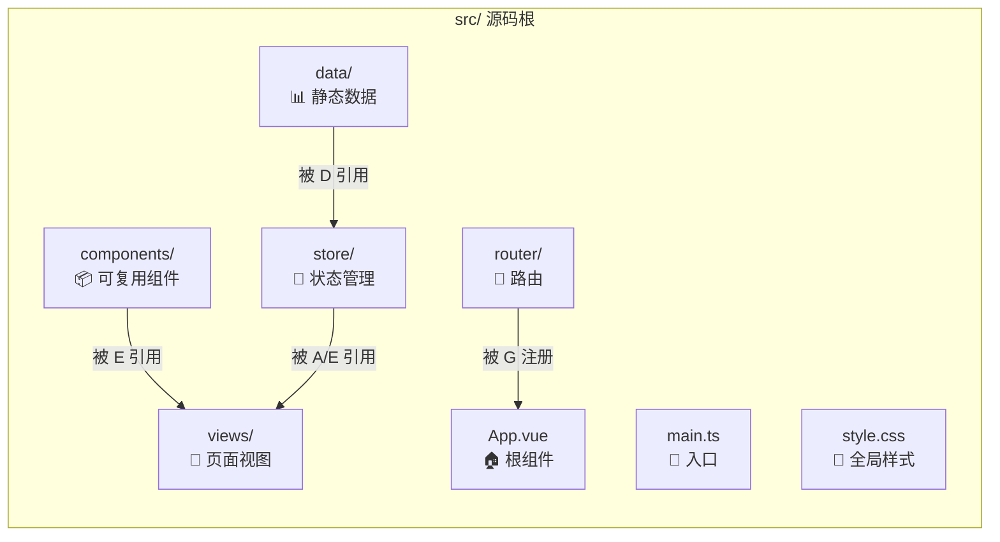
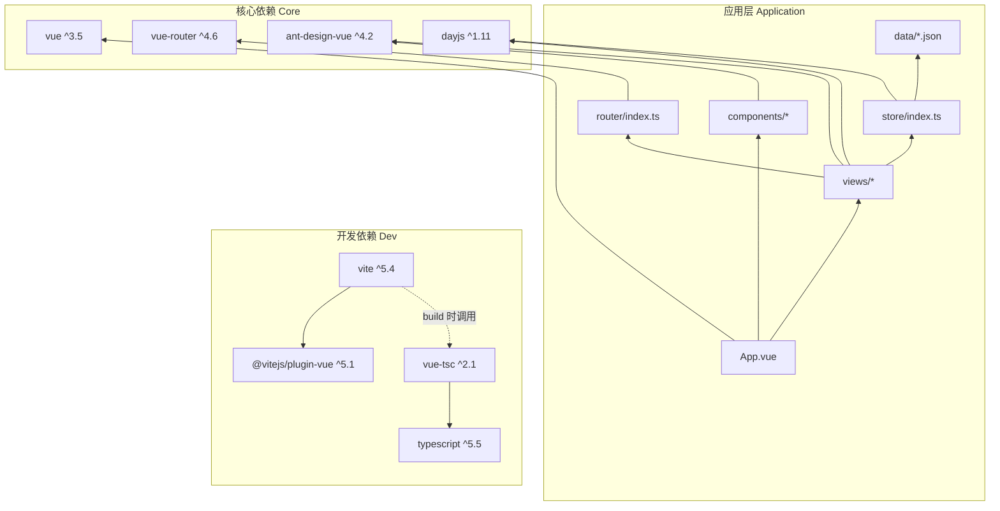

# 标准项目结构文档 (Standard Project Structure)

> **生成时间**: 2026-04-27
> **关联文件**: [`index.md`](index.md) | **语言**: 中文 (zh-CN)

---

## 概述

本文档定义 QA Live Healthcare 项目的**标准化目录结构**、**文件组织规范**和**模块职责划分**。所有参与开发的 AI 模型和开发人员应遵循此结构约定。

### 项目脚手架来源

本项目基于 **Vite 官方 Vue 3 + TypeScript 模板**（`create-vite` → `vue-ts`）初始化，在此基础上扩展了业务目录结构。

---

## 完整目录树

```
qa-live-healthcare/                          # 项目根目录
│
├── .asdm/                                   # ASDM 工具集配置（运行时生成）
│   ├── contexts/                            # Context Builder 生成的上下文文档
│   │   ├── index.md                         #   工作区索引与指南
│   │   ├── data-models.md                   #   数据模型文档
│   │   └── standard-project-structure.md    #   本文档
│   └── toolsets/                            #   已安装的工具集
│       └── context-builder/                 #     Context Builder 工具集
│           ├── actions/                     #       可执行指令
│           └── INSTALL.md                   #       安装说明
│
├── .codebuddy/                              # CodeBuddy IDE 配置
│   └── commands/                            #   自定义斜杠命令
│       ├── asdm-context-build.md            #     上下文构建命令
│       └── asdm-context-update.md           #     上下文更新命令
│
├── public/                                  # 静态资源目录（原样复制到输出）
│   └── vite.svg                             #   网站图标 (SVG)
│
├── src/                                     # 源代码根目录
│   ├── assets/                              # 资源文件（经 Vite 构建处理）
│   │   └── vue.svg                          #   Vue logo 图片资源
│   │
│   ├── components/                          # 全局可复用组件
│   │   ├── AppHeader.vue                    #   应用页头导航栏组件
│   │   ├── AppFooter.vue                    #   应用页脚信息组件
│   │   └── HelloWorld.vue                   #   Vite 默认示例组件（可清理）
│   │
│   ├── data/                                # 静态数据源（JSON 格式）
│   │   ├── doctor-user-list.json            #   医生用户预设数据
│   │   ├── patient-user.json                #   患者用户预设数据
│   │   └── question-list.json               #   问诊问题预设数据
│   │
│   ├── router/                              # 路由配置模块
│   │   └── index.ts                         #   Vue Router 路由定义表
│   │
│   ├── store/                               # 状态管理模块
│   │   └── index.ts                         #   响应式状态容器 + 类型 + 方法
│   │
│   ├── views/                               # 页面级视图组件
│   │   ├── Home.vue                         #   首页视图
│   │   ├── Doctors.vue                      #   医生团队列表视图
│   │   ├── Consultation.vue                 #   患者咨询门户视图
│   │   ├── DoctorLogin.vue                  #   医生登录视图
│   │   ├── DoctorRoom.vue                   #   医生诊室工作台视图
│   │   └── About.vue                        #   关于平台视图
│   │
│   ├── App.vue                              # 根组件（布局框架）
│   ├── main.ts                              # 应用入口（创建并挂载 Vue 实例）
│   ├── style.css                            # 全局样式表
│   └── vite-env.d.ts                        # Vite/Vue 类型环境声明
│
├── index.html                               # HTML 入口模板
├── package.json                             # NPM 包配置与依赖声明
├── package-lock.json                        # NPM 依赖锁定文件
├── README.md                                # 项目说明文档
├── tsconfig.json                            # TypeScript 基础配置（引用式）
├── tsconfig.app.json                        # TypeScript 应用代码配置
├── tsconfig.node.json                       # TypeScript Node/Vite 配置
├── tsconfig.app.tsbuildinfo                 # TS 应用编译缓存
├── tsconfig.node.tsbuildinfo                # TS Node 编译缓存
└── vite.config.ts                           # Vite 构建工具配置
```

---

## 目录职责详解

### 根目录文件

| 文件/目录 | 类型 | 职责 | 是否纳入版本控制 |
|-----------|------|------|------------------|
| `index.html` | HTML | SPA 入口模板，包含 `<div id="app">` 挂载点和 main.ts 引入 | ✅ 是 |
| `package.json` | JSON | NPM 元数据：名称、版本、脚本命令、依赖列表 | ✅ 是 |
| `package-lock.json` | JSON | 精确锁定依赖版本树 | ✅ 是 |
| `README.md` | Markdown | 项目描述和使用说明（当前为默认模板内容） | ✅ 是 |
| `vite.config.ts` | TypeScript | Vite 插件、构建选项、开发服务器配置 | ✅ 是 |
| `tsconfig.json` | JSON | TypeScript 项目引用配置（聚合 app + node） | ✅ 是 |
| `tsconfig.app.json` | JSON | 应用代码 TS 编译选项（严格模式开启） | ✅ 是 |
| `tsconfig.node.json` | JSON | Vite 配置文件的 TS 编译选项 | ✅ 是 |
| `*.tsbuildinfo` | Binary | TypeScript 增量编译缓存 | ⚠️ 通常忽略 |

### `.asdm/` 目录

| 目录/文件 | 说明 | 生命周期 |
|-----------|------|----------|
| `.asdm/contexts/` | Context Builder 工具集生成的上下文文档存放目录 | 由 `/asdm-context-build` 和 `/asdm-context-update` 维护 |
| `.asdm/toolsets/` | 已安装的 ASDM 工具集本地副本 | 由 `asdm toolset install` 管理 |
| `.asdm/contexts/index.md` | 工作区索引，AI 模型的首要参考文档 | 按需通过 `/asdm-context-update` 更新 |
| `.asdm/contexts/data-models.md` | 完整数据模型文档 | 按需生成 |
| `.asdm/contexts/*.md` | 其他上下文文档（待生成） | 按需生成 |

### `public/` vs `src/assets/` 对比

| 特性 | `public/` | `src/assets/` |
|------|-----------|----------------|
| 访问方式 | 绝对路径 `/vite.svg` | 相对导入 `import logo from './assets/vue.svg'` |
| 构建处理 | **原样复制**到输出目录 | 经 Vite **优化处理**（哈希命名、压缩） |
| 适用场景 | 不变的静态文件（favicon 等） | 源码中 import 引用的资源 |
| 当前内容 | `vite.svg`（网站 favicon） | `vue.svg`（Vite 默认 logo） |

### `src/` 源码目录

#### 一级子目录分类



---

## 各模块详细说明

### 1. 入口层 (`main.ts` + `index.html`)

#### `index.html`

```
位置: /index.html
作用: SPA 的 HTML Shell，浏览器首先加载此文件
关键点:
  - <div id="app"> → Vue 挂载目标
  - <script type="module" src="/src/main.ts"> → ES Module 方式加载入口 JS
  - <link rel="icon" href="/vite.svg"> → 网站图标
```

#### `main.ts`

```
位置: src/main.ts
行数: ~13 行
职责: 创建 Vue 应用实例，注册全局插件，挂载到 DOM

执行顺序:
  1. import Antd from 'ant-design-vue'          → 导入 UI 组件库
  2. import 'ant-design-vue/dist/reset.css'      → 导入基础样式重置
  3. import './style.css'                          → 导入全局自定义样式
  4. import App from './App.vue'                   → 导入根组件
  5. import router from './router'                 → 导入路由实例
  6. createApp(App)                                → 创建应用
  7. app.use(Antd)                                 → 注册 Ant Design Vue（全局可用）
  8. app.use(router)                               → 注册 Vue Router
  9. app.mount('#app')                             → 挂载到 DOM
```

### 2. 根组件 (`App.vue`)

```
位置: src/App.vue
行数: ~40 行
职责: 定义全局页面布局结构

布局结构:
  ┌─────────────────────────────┐
  │     AppHeader (固定顶栏)     │  ← position: fixed, z-index: 1000
  ├─────────────────────────────┤
  │                             │
  │   <RouterView />            │  ← 路由出口，动态渲染各页面视图
  │   (a-layout-content)        │
  │                             │
  ├─────────────────────────────┤
  │     AppFooter (底部区域)     │
  └─────────────────────────────┘

样式特点:
  - 全局 CSS 重置: * { margin:0; padding:0; box-sizing:border-box }
  - 最小高度: min-height: 100vh
  - 内容区背景: #fff
```

### 3. 组件层 (`src/components/`)

#### 组件清单

| 组件名 | 文件 | 类型 | 用途 | 使用者 |
|--------|------|------|------|--------|
| `AppHeader` | `AppHeader.vue` | Layout | 固定导航栏：Logo + 导航菜单 + 医生登录按钮 | `App.vue` |
| `AppFooter` | `AppFooter.vue` | Layout | 页脚：平台信息 + 快速链接 + 联系方式 + 法律信息 | `App.vue` |
| `HelloWorld` | `HelloWorld.vue` | Demo | Vite 脚手架示例组件 | **未使用**（可删除） |

#### AppHeader 详细结构

```
组件层级:
  <a-layout-header>
    ├─ Logo 区域 (图片 + "QA Live Healthcare" 文字)
    ├─ 导航菜单 (a-menu mode="horizontal")
    │   ├─ 首页 (/)
    │   ├─ 问诊 (/consultation)
    │   ├─ 医生 (/doctors)
    │   └─ 关于 (/about)
    └─ "医生登录" 按钮 → /doctor/login

行为:
  - 固定在顶部 (position: fixed, height: 64px)
  - 使用 watch 监听 route.path 自动高亮当前菜单项
  - 最大宽度 1200px 居中
```

#### AppFooter 详细结构

```
组件层级:
  <a-layout-footer>
    ├─ 四列网格布局 (grid-template-columns: auto-fit minmax(250px))
    │   ├─ 列1: 平台名称 + 简介
    │   ├─ 列2: 快速链接 (首页/问诊/医生/关于)
    │   ├─ 列3: 联系我们 (热线/邮箱/服务时间)
    │   └─ 列4: 法律信息 (隐私政策/服务条款/免责声明)
    └─ 底部版权栏: © 2025 QA Live Healthcare

样式:
  - 渐变背景: linear-gradient(135deg, #667eea, #764ba2)
  - 白色文字
```

### 4. 路由模块 (`src/router/index.ts`)

```
位置: src/router/index.ts
行数: ~53 行
模式: createWebHistory() — HTML5 History 模式（无 # 号）

路由表:

  路径                      名称              组件               参数
  ─────────────────────────────────────────────────────────────────
  /                         Home              Home.vue           无
  /consultation             Consultation       Consultation.vue   无
  /consultation/:doctorUsername  ConsultationRoom  Consultation.vue   doctorUsername(字符串)
  /doctors                  Doctors            Doctors.vue        无
  /about                    About              About.vue          无
  /doctor/login             DoctorLogin         DoctorLogin.vue    无
  /doctor/room/:username    DoctorRoom          DoctorRoom.vue     username(字符串)

路由特性:
  - 所有组件采用懒加载方式的静态导入（非动态 import）
  - 动态路由参数: :doctorUsername (患者入口), :username (医生诊室)
```

### 5. 状态管理层 (`src/store/index.ts`)

```
位置: src/store/index.ts
行数: ~159 行
架构模式: Composition API reactive store (轻量级, 非 Pinia/Vuex)

导出内容:
  ┌─ 接口类型 (Interfaces)
  │   ├─ Doctor          医生实体类型
  │   ├─ Patient         患者者体类型
  │   └─ Question        问题实体类型
  │
  └─ store 对象 (Object)
      ├─ state           reactive<State> 响应式状态容器
      │   ├─ doctors: Doctor[]           从 JSON 加载
      │   ├─ patients: Patient[]         从 JSON 加载 (运行时可追加)
      │   ├─ questions: Question[]       从 JSON 加载 (运行时可追加)
      │   ├─ currentDoctor: Doctor|null  会话级
      │   └─ currentPatient: Patient|null 会话级
      │
      └─ 方法 (Methods)
          ├─ 认证类: loginDoctor(), logoutDoctor(), verifyPatient(), logoutPatient()
          ├─ 问题类: addQuestion(), answerQuestion(), markQuestionAsAnswered()
          ├─ 查询类: getQuestionsByDoctor(), getQuestionsByPatient(), getActiveDoctors(), getDoctorByUsername()
          └─ 统计类: getStatistics()

设计决策:
  - 选择 reactive 而非 Pinia: 项目规模较小，无需引入额外依赖
  - 数据冗余存储: Question 中保存 patientName/doctorName 避免 JOIN
  - 无持久化机制: 页面刷新后丢失动态数据（符合 MVP 阶段定位）
```

### 6. 视图层 (`src/views/`)

视图组件是**页面级**的单文件组件，每个对应一个路由。

#### 视图总览

```mermaid
graph LR
    subgraph 公开页面 "Public Pages (无需认证)"
        H[Home.vue<br/>首页]
        DD[Doctors.vue<br/>医生列表]
        AB[About.vue<br/>关于]
    end

    subgraph 患者端 "Patient Portal"
        CV[Consultation.vue<br/>咨询页<br/>(含身份验证)]
    end

    subgraph 医生端 "Doctor Portal"
        DL[DoctorLogin.vue<br/>登录]
        DR[DoctorRoom.vue<br/>诊室工作台]
    end

    H -->|点击问诊| CV
    H -->|选择诊室| CV
    H -->|点击医生| DD
    DL -->|登录成功| DR
    DR -->|权限不足| DL
```

#### 各视图元数据

| 视图 | 文件大小 | 行数 | 组件类型 | 路由守卫 | API 依赖 |
|------|---------|------|----------|----------|----------|
| Home.vue | 中等 | ~380 | 展示型 | 无 | Store: getStatistics, getActiveDoctors |
| Doctors.vue | 中等 | ~177 | 展示+交互 | 无 | Store: state.doctors |
| Consultation.vue | 大 | ~480 | 表单+列表+弹窗 | 弱（身份验证门控） | Store: 8 个方法 |
| DoctorLogin.vue | 小 | ~145 | 表单 | 无 | Store: loginDoctor |
| DoctorRoom.vue | 大 | ~400 | 列表+弹窗+折叠面板 | 强（onMounted 校验） | Store: 6 个方法 |
| About.vue | 中 | ~293 | 纯展示 | 无 | 无 |

### 7. 数据层 (`src/data/`)

```
目录: src/data/
格式: JSON (纯文本)
用途: 作为 Store 的初始数据源，应用启动时一次性导入

文件说明:

  doctor-user-list.json (~1.2KB)
  ├── 记录数: 5 条
  ├── 字段: id, username, password, name, title, department,
  │         avatar, experience, specialties[], isActive
  └── 用途: 医生账号库 + 首页/医生列表展示数据源

  patient-user.json (~0.5KB)
  ├── 记录数: 5 条
  ├── 字段: id, name, birthday, phone, gender
  └── 用途: 患者身份验证的匹配基准数据

  question-list.json (~1.8KB)
  ├── 记录数: 7 条
  ├── 字段: id, patientId, patientName, doctorId, doctorName,
  │         question, submitTime, status, answer, answerTime
  └─ 用途: 问诊历史记录初始数据
```

---

## 文件命名规范

### Vue 单文件组件 (SFC)

| 类别 | 命名规则 | 示例 |
|------|----------|------|
| 页面视图 | PascalCase + 功能描述 | `Home.vue`, `DoctorRoom.vue` |
| 可复用组件 | PascalCase + 用途前缀 | `AppHeader.vue`, `AppFooter.vue` |
| 示例/Demo | PascalCase + 任意 | `HelloWorld.vue` |

### TypeScript 文件

| 类别 | 命名规则 | 示例 |
|------|----------|------|
| 模块入口 | `index.ts` | `router/index.ts`, `store/index.ts` |
| 配置文件 | kebab-case 或 camelCase | `vite.config.ts`, `tsconfig.app.json` |
| 类型声明 | `-env.d.ts` 或 `.d.ts` | `vite-env.d.ts` |

### 数据文件

| 类别 | 命称规则 | 示例 |
|------|----------|------|
| JSON 数据 | kebab-case + 复数 | `doctor-user-list.json`, `question-list.json` |
| 静态资源 | 按原始格式 | `vue.svg`, `vite.svg` |

### 样式文件

| 类别 | 命名规则 | 示例 |
|------|----------|------|
| 全局样式 | kebab-case | `style.css` |
| 组件内样式 | `<style scoped>` 块内联 | 各 SFC 内部 |

---

## 导入/导出规范

### 导入风格

```typescript
// ✓ Vue 核心 API — 从 'vue' 导入
import { createApp, reactive, computed, ref, onMounted } from 'vue';
import { useRouter, useRoute } from 'vue-router';

// ✓ 第三方库 — 从包名导入
import { message } from 'ant-design-vue';
import dayjs, { Dayjs } from 'dayjs';
import { CheckCircleOutlined, TeamOutlined } from '@ant-design/icons-vue';

// ✓ 内部模块 — 相对路径导入
import router from './router';
import { store, Doctor } from '../store';
import doctorData from '../data/doctor-user-list.json'; // JSON 直接导入

// ✓ 类型导入（TypeScript）
import type { RouteRecordRaw } from 'vue-router';
```

### 导出风格

```typescript
// ✓ Store 采用具名导出接口 + 默认导出单例对象
export interface Doctor { ... }
export interface Patient { ... }
export interface Question { ... }

export const store = { state, methods... };

// ✓ 路由采用默认导出
const router = createRouter({ ... });
export default router;
```

---

## 构建配置详解

### Vite 配置 (`vite.config.ts`)

```typescript
// 当前配置（极简）
import { defineConfig } from 'vite'
import vue from '@vitejs/plugin-vue'

export default defineConfig({
  plugins: [vue()],    // 仅启用 Vue 插件
})

// 未配置项（使用默认值）：
//   - server.port: 5173
//   - server.host: localhost
//   - build.outDir: dist
//   - base: /
//   - 无代理、无别名、无环境变量
```

### TypeScript 配置体系

本项目采用 **Project References（项目引用）** 模式，TS 配置分为三层：

```
tsconfig.json              ← 根配置（纯引用，不编译任何文件）
  ├── tsconfig.app.json    ← 应用代码配置（编译 src/**/*.ts, *.tsx, *.vue）
  └── tsconfig.node.json   ← 配置文件编译（仅编译 vite.config.ts）
```

#### 关键编译选项对比

| 选项 | app | node | 说明 |
|------|-----|------|------|
| `target` | ES2020 | ES2022 | 编译目标 JavaScript 版本 |
| `lib` | ES2020, DOM, DOM.Iterable | ES2023 | 内置类型库 |
| `jsx` | `preserve` | - | Vue SFC 的 JSX 保留 |
| `include` | `src/**/*.{ts,tsx,vue}` | `vite.config.ts` | 编译范围 |
| `strict` | ✅ true | ✅ true | 严格模式 |
| `noUnusedLocals` | ✅ true | ✅ true | 未使用变量报错 |
| `noUnusedParameters` | ✅ true | ✅ true | 未使用参数报错 |
| `noFallthroughCasesInSwitch` | ✅ true | ✅ true | switch 穿透检查 |

---

## 依赖关系图

### 运行时依赖 (dependencies)

```
qa-live-healthcare@0.0.0
├── ant-design-vue@^4.2.6        UI 组件库 (全部页面均依赖)
├── dayjs@^1.11.19               日期处理 (Consultation, DoctorRoom 使用)
├── vue@^3.5.10                  核心框架
└── vue-router@^4.6.3            路由管理
```

### 开发依赖 (devDependencies)

```
├── @vitejs/plugin-vue@^5.1.4    Vite 的 Vue SFC 编译插件
├── typescript@^5.5.3             TypeScript 编译器
├── vite@^5.4.8                   构建工具 & 开发服务器
└── vue-tsc@^2.1.6                Vue SFC 的类型检查器 (npm run build 时调用)
```

### 依赖关系可视化



---

## NPM Scripts 命令

| 命令 | 执行操作 | 用途 |
|------|----------|------|
| `npm run dev` | `vite` | 启动开发服务器 (localhost:5173)，支持 HMR |
| `npm run build` | `vue-tsc -b && vite build` | 先做类型检查，再构建生产包到 `dist/` |
| `npm run preview` | `vite preview` | 本地预览生产构建产物 |

### Build 流程详解

```
npm run build
    │
    ├── Step 1: vue-tsc -b
    │   └── 使用 tsconfig.app.json 进行 TypeScript 类型检查
    │       若有类型错误则终止构建
    │
    └── Step 2: vite build
        ├── 读取 vite.config.ts
        ├── 使用 @vitejs/plugin-vue 编译 .vue 文件
        ├── Rollup 打包 + Tree-shaking
        ├── 输出到 dist/
        │   ├── index.html
        │   ├── assets/[hash].js
        │   └── assets/[hash].css
        └── 完成
```

---

## 文件大小与复杂度概览

| 文件 | 大约行数 | 复杂度评级 | 说明 |
|------|---------|-----------|------|
| `src/store/index.ts` | ~159 | 🔴 高 | 类型定义 + 状态 + 10个方法，系统核心 |
| `src/views/Consultation.vue` | ~480 | 🔴 高 | 身份验证 + 双模式 + 表单 + 列表 + 弹窗 |
| `src/views/Home.vue` | ~380 | 🟡 中 | 三区块展示 + 统计计算 |
| `src/views/DoctorRoom.vue` | ~400 | 🟡 中 | 权限守卫 + 双问题列表 + 回复弹窗 |
| `src/views/About.vue` | ~293 | 🟡 中 | 纯静态四区块 |
| `src/components/AppHeader.vue` | ~121 | 🟢 低 | 导航栏 + 菜单高亮逻辑 |
| `src/components/AppFooter.vue` | ~107 | 🟢 低 | 纯展示无逻辑 |
| `src/views/Doctors.vue` | ~177 | 🟢 低 | 列表渲染 + 路由跳转 |
| `src/views/DoctorLogin.vue` | ~145 | 🟢 低 | 表单 + 登录校验 |
| `src/App.vue` | ~40 | 🟢 低 | 布局壳 |
| `src/main.ts` | ~13 | 🟢 低 | 应用引导 |

---

## 待改进/建议项

以下是基于当前项目结构分析出的潜在改进方向：

| 编号 | 建议 | 当前状态 | 影响 |
|------|------|----------|------|
| STR-01 | 删除未使用的 `HelloWorld.vue` | Vite 默认残留 | 减少无用代码 |
| STR-02 | 更新 `index.html` 的 `<title>` 为 "QA Live Healthcare" | 仍为默认值 "Vite + Vue + TS" | SEO 与标签页识别 |
| STR-03 | 为 `vite.config.ts` 添加路径别名（如 `@/` → `src/`） | 未配置 | 简化深层导入路径 |
| STR-04 | 将 `data/*.json` 迁移至 Mock 服务或 API 层 | 硬编码 JSON import | 为后续对接后端做准备 |
| STR-05 | 引入 Pinia 替代手动 reactive store | 手工实现状态管理 | 更规范的响应式状态管理 + DevTools 支持 |
| STR-06 | 补充单元测试（Vitest）| 缺失测试 | 保障代码质量 |
| STR-07 | 添加 ESLint + Prettier 配置 | 仅依赖 TS 严格模式 | 代码风格统一化 |

---

*此文件由 Context Builder 自动生成，属于 [index.md](index.md) 上下文体系的补充文档。*
