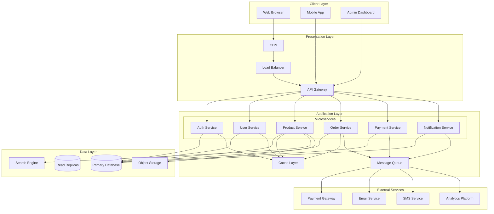
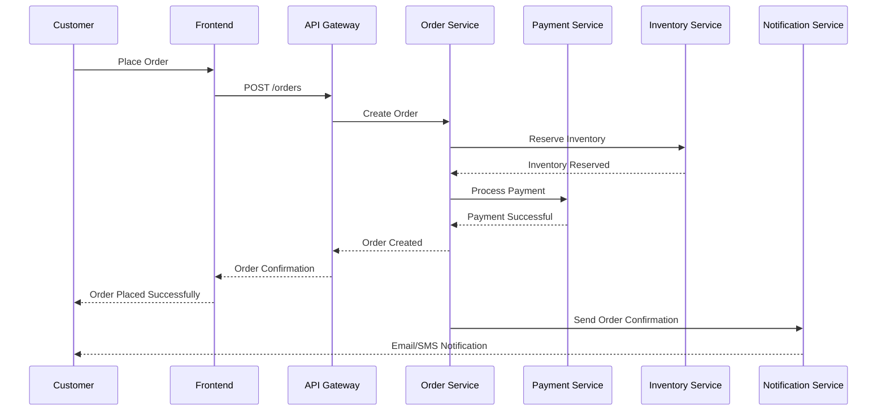
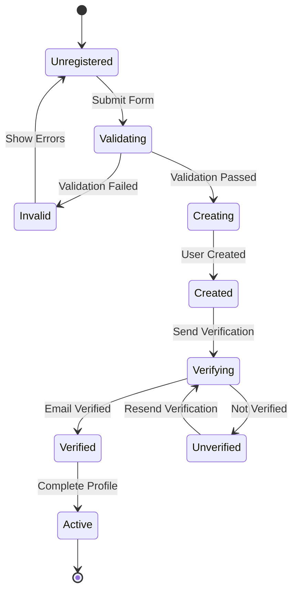
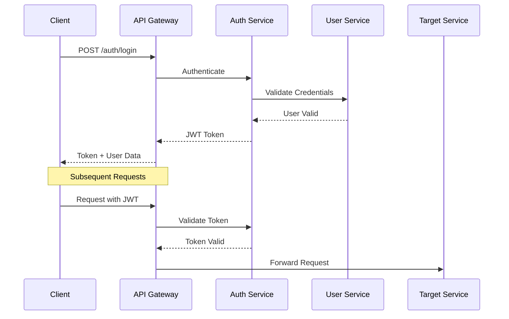

# System Architecture

## Overview
This document describes the overall system architecture, design decisions, and technical patterns used in this workspace. It provides AI models with a comprehensive understanding of the system's structure and design principles.

## Architecture Overview

### High-Level Architecture Diagram


## Architecture Principles

### 1. Separation of Concerns
- **Presentation Layer**: Handles user interaction and API requests
- **Application Layer**: Contains business logic and services
- **Data Layer**: Manages data storage and retrieval
- **Infrastructure Layer**: Provides cross-cutting concerns

### 2. Microservices Architecture
- Each service has a single responsibility
- Services communicate via well-defined APIs
- Independent deployment and scaling
- Polyglot persistence (right database for each service)

### 3. Event-Driven Design
- Loose coupling between services
- Asynchronous processing for long-running tasks
- Event sourcing for audit trails
- Real-time updates via WebSockets

### 4. Resilience and Fault Tolerance
- Circuit breakers for external service calls
- Retry mechanisms with exponential backoff
- Bulkheads to isolate failures
- Graceful degradation under load

## Component Details

### API Gateway
**Purpose**: Single entry point for all client requests
**Responsibilities**:
- Request routing and composition
- Authentication and authorization
- Rate limiting and throttling
- Request/response transformation
- API versioning

**Technology**: Kong/NGINX/Spring Cloud Gateway

### Authentication Service
**Purpose**: Manage user authentication and authorization
**Responsibilities**:
- User registration and login
- JWT token generation and validation
- OAuth2/OIDC integration
- Session management
- Role-based access control

**Technology**: Spring Security/Keycloak/Auth0

### User Service
**Purpose**: Manage user profiles and preferences
**Responsibilities**:
- User profile CRUD operations
- Preference management
- Avatar and file uploads
- User search and filtering

**Database**: PostgreSQL with JSONB for flexible profiles

### Product Service
**Purpose**: Manage product catalog and inventory
**Responsibilities**:
- Product CRUD operations
- Inventory management
- Product search and filtering
- Category management
- Product recommendations

**Database**: PostgreSQL for transactional data, Elasticsearch for search

### Order Service
**Purpose**: Process and manage customer orders
**Responsibilities**:
- Order creation and validation
- Order status management
- Order history and tracking
- Inventory reservation
- Order fulfillment coordination

**Database**: PostgreSQL with optimistic locking for concurrency

### Payment Service
**Purpose**: Handle payment processing
**Responsibilities**:
- Payment method management
- Payment processing and validation
- Refund handling
- Payment gateway integration
- Fraud detection

**External Integrations**: Stripe/PayPal/Braintree

### Notification Service
**Purpose**: Send notifications to users
**Responsibilities**:
- Email notifications
- SMS notifications
- Push notifications
- Notification templates
- Delivery tracking

**External Integrations**: SendGrid/Twilio/Firebase Cloud Messaging

## Data Flow Patterns

### Order Processing Flow


### User Registration Flow


## Design Patterns

### Repository Pattern
```typescript
interface UserRepository {
  findById(id: number): Promise<User | null>;
  findByEmail(email: string): Promise<User | null>;
  save(user: User): Promise<User>;
  update(user: User): Promise<User>;
  delete(id: number): Promise<void>;
}

class PostgreSQLUserRepository implements UserRepository {
  constructor(private connection: DatabaseConnection) {}
  
  async findById(id: number): Promise<User | null> {
    const result = await this.connection.query(
      'SELECT * FROM users WHERE id = $1',
      [id]
    );
    return result.rows[0] || null;
  }
}
```

### Service Pattern
```typescript
class UserService {
  constructor(
    private userRepository: UserRepository,
    private emailService: EmailService,
    private validator: Validator
  ) {}
  
  async registerUser(registrationData: RegistrationData): Promise<User> {
    // Validate input
    await this.validator.validate(registrationData);
    
    // Check for existing user
    const existingUser = await this.userRepository.findByEmail(
      registrationData.email
    );
    if (existingUser) {
      throw new ConflictError('User already exists');
    }
    
    // Create user
    const user = User.create(registrationData);
    const savedUser = await this.userRepository.save(user);
    
    // Send welcome email
    await this.emailService.sendWelcomeEmail(savedUser.email);
    
    return savedUser;
  }
}
```

### Factory Pattern
```typescript
interface PaymentProcessor {
  processPayment(amount: number, paymentData: any): Promise<PaymentResult>;
}

class StripeProcessor implements PaymentProcessor {
  async processPayment(amount: number, paymentData: any): Promise<PaymentResult> {
    // Stripe-specific implementation
  }
}

class PayPalProcessor implements PaymentProcessor {
  async processPayment(amount: number, paymentData: any): Promise<PaymentResult> {
    // PayPal-specific implementation
  }
}

class PaymentProcessorFactory {
  static create(provider: string): PaymentProcessor {
    switch (provider) {
      case 'stripe':
        return new StripeProcessor();
      case 'paypal':
        return new PayPalProcessor();
      default:
        throw new Error(`Unsupported payment provider: ${provider}`);
    }
  }
}
```

### Observer Pattern
```typescript
interface OrderObserver {
  onOrderCreated(order: Order): Promise<void>;
  onOrderStatusChanged(order: Order, oldStatus: OrderStatus): Promise<void>;
}

class InventoryObserver implements OrderObserver {
  async onOrderCreated(order: Order): Promise<void> {
    // Reserve inventory for order items
    await this.inventoryService.reserveItems(order.items);
  }
  
  async onOrderStatusChanged(order: Order, oldStatus: OrderStatus): Promise<void> {
    if (order.status === OrderStatus.CANCELLED && oldStatus !== OrderStatus.CANCELLED) {
      // Release reserved inventory
      await this.inventoryService.releaseItems(order.items);
    }
  }
}

class NotificationObserver implements OrderObserver {
  async onOrderCreated(order: Order): Promise<void> {
    // Send order confirmation
    await this.notificationService.sendOrderConfirmation(order);
  }
  
  async onOrderStatusChanged(order: Order, oldStatus: OrderStatus): Promise<void> {
    // Send status update notification
    await this.notificationService.sendStatusUpdate(order);
  }
}
```

## Integration Patterns

### Synchronous HTTP Communication
```typescript
// Service-to-service communication
class ProductServiceClient {
  constructor(private httpClient: HttpClient) {}
  
  async getProduct(productId: number): Promise<Product> {
    const response = await this.httpClient.get(
      `${this.baseUrl}/products/${productId}`
    );
    return response.data;
  }
  
  async updateStock(productId: number, quantity: number): Promise<void> {
    await this.httpClient.patch(
      `${this.baseUrl}/products/${productId}/stock`,
      { quantity }
    );
  }
}
```

### Asynchronous Message Queue
```typescript
// Event publishing
class OrderService {
  constructor(private messageQueue: MessageQueue) {}
  
  async createOrder(orderData: OrderData): Promise<Order> {
    const order = await this.orderRepository.create(orderData);
    
    // Publish order created event
    await this.messageQueue.publish('order.created', {
      orderId: order.id,
      userId: order.userId,
      totalAmount: order.totalAmount,
      timestamp: new Date()
    });
    
    return order;
  }
}

// Event consumption
class NotificationService {
  constructor(private messageQueue: MessageQueue) {
    this.messageQueue.subscribe('order.created', this.handleOrderCreated.bind(this));
  }
  
  private async handleOrderCreated(event: OrderCreatedEvent): Promise<void> {
    const user = await this.userService.getUser(event.userId);
    await this.emailService.send({
      to: user.email,
      subject: 'Order Confirmation',
      template: 'order-confirmation',
      data: { orderId: event.orderId }
    });
  }
}
```

## Security Architecture

### Authentication Flow


### Authorization Model
```typescript
// Role-based access control
enum UserRole {
  ADMIN = 'ADMIN',
  MANAGER = 'MANAGER',
  USER = 'USER',
  GUEST = 'GUEST'
}

// Permission-based access control
enum Permission {
  USER_READ = 'user:read',
  USER_WRITE = 'user:write',
  PRODUCT_READ = 'product:read',
  PRODUCT_WRITE = 'product:write',
  ORDER_READ = 'order:read',
  ORDER_WRITE = 'order:write'
}

// Policy definition
const policies = {
  [UserRole.ADMIN]: [
    Permission.USER_READ,
    Permission.USER_WRITE,
    Permission.PRODUCT_READ,
    Permission.PRODUCT_WRITE,
    Permission.ORDER_READ,
    Permission.ORDER_WRITE
  ],
  [UserRole.USER]: [
    Permission.USER_READ,
    Permission.PRODUCT_READ,
    Permission.ORDER_READ,
    Permission.ORDER_WRITE
  ]
};
```

## Performance Considerations

### Caching Strategy
```typescript
// Multi-level caching
class ProductService {
  constructor(
    private productRepository: ProductRepository,
    private localCache: LocalCache,
    private distributedCache: DistributedCache,
    private cdn: CDNService
  ) {}
  
  async getProduct(productId: number): Promise<Product> {
    // Check local cache first
    let product = await this.localCache.get(`product:${productId}`);
    if (product) return product;
    
    // Check distributed cache
    product = await this.distributedCache.get(`product:${productId}`);
    if (product) {
      // Populate local cache
      await this.localCache.set(`product:${productId}`, product, 60);
      return product;
    }
    
    // Fetch from database
    product = await this.productRepository.findById(productId);
    if (!product) throw new NotFoundError('Product not found');
    
    // Update caches
    await Promise.all([
      this.localCache.set(`product:${productId}`, product, 60),
      this.distributedCache.set(`product:${productId}`, product, 300),
      this.cdn.cacheProductImage(product.imageUrl)
    ]);
    
    return product;
  }
}
```

### Database Optimization
```sql
-- Indexing strategy
CREATE INDEX idx_users_email ON users(email);
CREATE INDEX idx_products_category_id ON products(category_id);
CREATE INDEX idx_orders_user_id_status ON orders(user_id, status);

-- Partitioning for large tables
CREATE TABLE orders_2024 PARTITION OF orders
FOR VALUES FROM ('2024-01-01') TO ('2025-01-01');

-- Materialized views for complex queries
CREATE MATERIALIZED VIEW product_sales_summary AS
SELECT 
  product_id,
  COUNT(*) as total_orders,
  SUM(quantity) as total_quantity,
  SUM(subtotal) as total_revenue
FROM order_items
GROUP BY product_id;
```

## Monitoring and Observability

### Metrics Collection
```typescript
// Application metrics
class MetricsCollector {
  private requestDuration = new Histogram({
    name: 'http_request_duration_seconds',
    help: 'Duration of HTTP requests in seconds',
    labelNames: ['method', 'route', 'status']
  });
  
  private activeRequests = new Gauge({
    name: 'http_requests_active',
    help: 'Number of active HTTP requests'
  });
  
  async measureRequest<T>(
    method: string,
    route: string,
    handler: () => Promise<T>
  ): Promise<T> {
    const end = this.requestDuration.startTimer({ method, route });
    this.activeRequests.inc();
    
    try {
      const result = await handler();
      end({ status: 'success' });
      return result;
    } catch (error) {
      end({ status: 'error' });
      throw error;
    } finally {
      this.activeRequests.dec();
    }
  }
}
```

### Distributed Tracing
```yaml
# OpenTelemetry configuration
service:
  name: order-service
  version: 1.0.0

tracing:
  exporter: jaeger
  endpoint: http://jaeger:14268/api/traces
  
  sampling:
    type: probabilistic
    rate: 0.1
  
  attributes:
    environment: production
    region: us-east-1
```

## Deployment Architecture

### Container Orchestration
```yaml
# Kubernetes deployment
apiVersion: apps/v1
kind: Deployment
metadata:
  name: order-service
spec:
  replicas: 3
  selector:
    matchLabels:
      app: order-service
  template:
    metadata:
      labels:
        app: order-service
    spec:
      containers:
      - name: order-service
        image: registry.example.com/order-service:latest
        ports:
        - containerPort: 8080
        env:
        - name: DATABASE_URL
          valueFrom:
            secretKeyRef:
              name: order-service-secrets
              key: database-url
        resources:
          requests:
            memory: "256Mi"
            cpu: "250m"
          limits:
            memory: "512Mi"
            cpu: "500m"
        livenessProbe:
          httpGet:
            path: /health
            port: 8080
        readinessProbe:
          httpGet:
            path: /ready
            port: 8080
```

### Service Mesh
```yaml
# Istio configuration
apiVersion: networking.istio.io/v1beta1
kind: VirtualService
metadata:
  name: order-service
spec:
  hosts:
  - order-service
  http:
  - route:
    - destination:
        host: order-service
        subset: v1
    retries:
      attempts: 3
      perTryTimeout: 2s
    timeout: 10s
  
  - match:
    - headers:
        x-canary:
          exact: "true"
    route:
    - destination:
        host: order-service
        subset: v2
```

## Evolution and Migration

### Versioning Strategy
- **API Versioning**: URL path versioning (`/api/v1/`, `/api/v2/`)
- **Database Migrations**: Flyway/Liquibase for schema evolution
- **Service Compatibility**: Backward compatibility for 2 major versions
- **Deprecation Policy**: 6 months notice before breaking changes

### Migration Patterns
```typescript
// Database migration example
class AddUserProfileMigration {
  async up(connection: DatabaseConnection): Promise<void> {
    await connection.query(`
      CREATE TABLE user_profiles (
        id SERIAL PRIMARY KEY,
        user_id INTEGER NOT NULL REFERENCES users(id),
        avatar_url VARCHAR(500),
        phone_number VARCHAR(20),
        created_at TIMESTAMP DEFAULT CURRENT_TIMESTAMP
      )
    `);
    
    // Data migration
    await connection.query(`
      INSERT INTO user_profiles (user_id, phone_number)
      SELECT id, phone FROM users WHERE phone IS NOT NULL
    `);
  }
  
  async down(connection: DatabaseConnection): Promise<void> {
    // Rollback logic
    await connection.query('DROP TABLE user_profiles');
  }
}
```

---

*This architecture documentation should be updated when significant design changes occur. Use `/context-update-instruction` to keep this document current.*