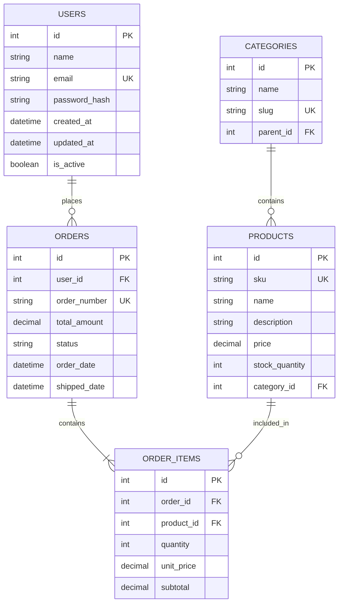
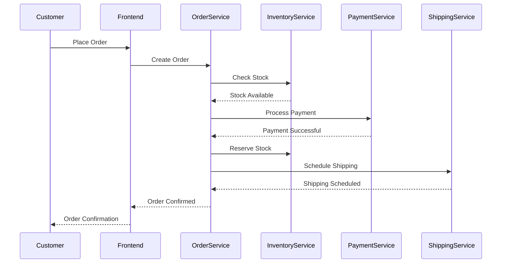
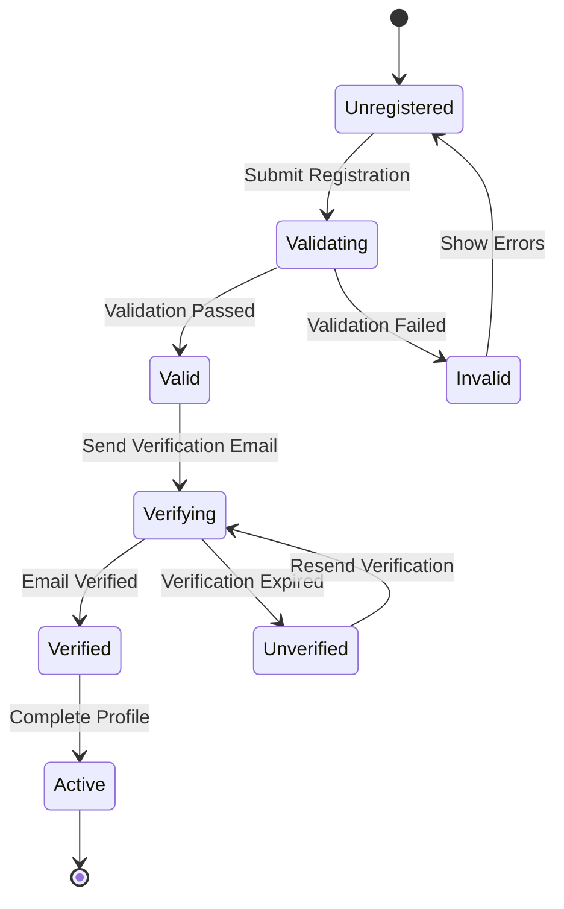

# Data Models

## Overview
This document describes the data models, relationships, and data flow for this workspace. It provides AI models with the necessary understanding of the data structure to work effectively with the codebase.

## Database Schema

### Overview Diagram


## Entity Definitions

### User Entity
**Purpose**: Represents system users with authentication and profile information.

```typescript
interface User {
  id: number;
  name: string;
  email: string;
  passwordHash: string;
  createdAt: Date;
  updatedAt: Date;
  isActive: boolean;
  roles: UserRole[];
  profile?: UserProfile;
  orders: Order[];
}

interface UserProfile {
  id: number;
  userId: number;
  avatarUrl?: string;
  phoneNumber?: string;
  address?: string;
  dateOfBirth?: Date;
}

enum UserRole {
  ADMIN = 'ADMIN',
  USER = 'USER',
  MANAGER = 'MANAGER'
}
```

### Product Entity
**Purpose**: Represents products available for purchase.

```typescript
interface Product {
  id: number;
  sku: string;
  name: string;
  description: string;
  price: number;
  stockQuantity: number;
  categoryId: number;
  category: Category;
  images: ProductImage[];
  attributes: ProductAttribute[];
  createdAt: Date;
  updatedAt: Date;
}

interface ProductImage {
  id: number;
  productId: number;
  url: string;
  altText: string;
  isPrimary: boolean;
  order: number;
}

interface ProductAttribute {
  id: number;
  productId: number;
  name: string;
  value: string;
}
```

### Order Entity
**Purpose**: Represents customer orders and their lifecycle.

```typescript
interface Order {
  id: number;
  orderNumber: string;
  userId: number;
  user: User;
  totalAmount: number;
  status: OrderStatus;
  orderDate: Date;
  shippedDate?: Date;
  deliveryAddress: Address;
  billingAddress: Address;
  items: OrderItem[];
  payments: Payment[];
}

interface OrderItem {
  id: number;
  orderId: number;
  productId: number;
  product: Product;
  quantity: number;
  unitPrice: number;
  subtotal: number;
}

enum OrderStatus {
  PENDING = 'PENDING',
  PROCESSING = 'PROCESSING',
  SHIPPED = 'SHIPPED',
  DELIVERED = 'DELIVERED',
  CANCELLED = 'CANCELLED',
  REFUNDED = 'REFUNDED'
}

interface Address {
  street: string;
  city: string;
  state: string;
  postalCode: string;
  country: string;
}
```

### Category Entity
**Purpose**: Organizes products into hierarchical categories.

```typescript
interface Category {
  id: number;
  name: string;
  slug: string;
  description?: string;
  parentId?: number;
  parent?: Category;
  children: Category[];
  products: Product[];
}
```

## Data Relationships

### One-to-Many Relationships
1. **User → Orders**: One user can have many orders
2. **Category → Products**: One category can contain many products
3. **Order → OrderItems**: One order can contain many items
4. **Product → OrderItems**: One product can appear in many order items

### Many-to-Many Relationships
1. **Products ↔ Categories**: Through parent-child hierarchy
2. **Users ↔ Roles**: Through role assignments

### Self-Referencing Relationships
1. **Category → Category**: Parent-child category hierarchy

## Data Flow Diagrams

### Order Processing Flow


### User Registration Flow


## Data Validation Rules

### User Validation
```typescript
const userValidationRules = {
  name: {
    required: true,
    minLength: 2,
    maxLength: 100,
    pattern: /^[a-zA-Z\s]+$/,
  },
  email: {
    required: true,
    pattern: /^[^\s@]+@[^\s@]+\.[^\s@]+$/,
    unique: true,
  },
  password: {
    required: true,
    minLength: 8,
    pattern: /^(?=.*[a-z])(?=.*[A-Z])(?=.*\d)(?=.*[@$!%*?&])[A-Za-z\d@$!%*?&]/,
  },
};
```

### Product Validation
```typescript
const productValidationRules = {
  sku: {
    required: true,
    pattern: /^[A-Z0-9]{3,}-[A-Z0-9]{3,}$/,
    unique: true,
  },
  name: {
    required: true,
    minLength: 3,
    maxLength: 200,
  },
  price: {
    required: true,
    min: 0.01,
    max: 1000000,
  },
  stockQuantity: {
    required: true,
    min: 0,
    integer: true,
  },
};
```

## Data Migration Strategies

### Version 1.0 to 1.1
```sql
-- Add user profile table
CREATE TABLE user_profiles (
  id SERIAL PRIMARY KEY,
  user_id INTEGER NOT NULL REFERENCES users(id) ON DELETE CASCADE,
  avatar_url VARCHAR(500),
  phone_number VARCHAR(20),
  address TEXT,
  date_of_birth DATE,
  created_at TIMESTAMP DEFAULT CURRENT_TIMESTAMP,
  updated_at TIMESTAMP DEFAULT CURRENT_TIMESTAMP
);

-- Migrate existing profile data from users table
INSERT INTO user_profiles (user_id, phone_number, address)
SELECT id, phone, address FROM users WHERE phone IS NOT NULL OR address IS NOT NULL;

-- Remove migrated columns from users table
ALTER TABLE users DROP COLUMN phone;
ALTER TABLE users DROP COLUMN address;
```

### Version 1.1 to 1.2
```sql
-- Add product attributes table for flexible product specifications
CREATE TABLE product_attributes (
  id SERIAL PRIMARY KEY,
  product_id INTEGER NOT NULL REFERENCES products(id) ON DELETE CASCADE,
  attribute_name VARCHAR(100) NOT NULL,
  attribute_value TEXT NOT NULL,
  display_order INTEGER DEFAULT 0,
  created_at TIMESTAMP DEFAULT CURRENT_TIMESTAMP,
  UNIQUE(product_id, attribute_name)
);

-- Create index for faster attribute lookups
CREATE INDEX idx_product_attributes_product_id ON product_attributes(product_id);
```

## Sample Data

### User Sample Data
```json
{
  "id": 1,
  "name": "John Doe",
  "email": "john.doe@example.com",
  "passwordHash": "$2b$10$...",
  "createdAt": "2024-01-15T10:30:00Z",
  "updatedAt": "2024-01-15T10:30:00Z",
  "isActive": true,
  "roles": ["USER"],
  "profile": {
    "avatarUrl": "https://example.com/avatars/john.jpg",
    "phoneNumber": "+1234567890",
    "address": "123 Main St, City, Country"
  }
}
```

### Product Sample Data
```json
{
  "id": 101,
  "sku": "ELEC-001",
  "name": "Wireless Bluetooth Headphones",
  "description": "Noise-cancelling wireless headphones with 30-hour battery",
  "price": 129.99,
  "stockQuantity": 50,
  "categoryId": 5,
  "images": [
    {
      "url": "https://example.com/products/headphones-1.jpg",
      "altText": "Front view of headphones",
      "isPrimary": true,
      "order": 1
    }
  ],
  "attributes": [
    {
      "name": "Color",
      "value": "Black"
    },
    {
      "name": "Battery Life",
      "value": "30 hours"
    }
  ]
}
```

### Order Sample Data
```json
{
  "id": 1001,
  "orderNumber": "ORD-2024-001",
  "userId": 1,
  "totalAmount": 259.98,
  "status": "DELIVERED",
  "orderDate": "2024-01-20T14:30:00Z",
  "shippedDate": "2024-01-21T09:15:00Z",
  "deliveryAddress": {
    "street": "123 Main St",
    "city": "New York",
    "state": "NY",
    "postalCode": "10001",
    "country": "USA"
  },
  "items": [
    {
      "productId": 101,
      "quantity": 2,
      "unitPrice": 129.99,
      "subtotal": 259.98
    }
  ]
}
```

## Data Access Patterns

### Repository Interfaces
```typescript
interface UserRepository {
  findById(id: number): Promise<User | null>;
  findByEmail(email: string): Promise<User | null>;
  save(user: User): Promise<User>;
  update(user: User): Promise<User>;
  delete(id: number): Promise<void>;
}

interface ProductRepository {
  findByCategory(categoryId: number, page: number, limit: number): Promise<Product[]>;
  search(query: string, filters: ProductFilters): Promise<Product[]>;
  updateStock(productId: number, quantity: number): Promise<void>;
}

interface OrderRepository {
  create(order: Order): Promise<Order>;
  findByUser(userId: number, status?: OrderStatus): Promise<Order[]>;
  updateStatus(orderId: number, status: OrderStatus): Promise<void>;
}
```

### Query Optimization
```sql
-- Indexes for common queries
CREATE INDEX idx_users_email ON users(email);
CREATE INDEX idx_products_category_id ON products(category_id);
CREATE INDEX idx_orders_user_id_status ON orders(user_id, status);
CREATE INDEX idx_order_items_order_id ON order_items(order_id);

-- Composite indexes for frequently joined tables
CREATE INDEX idx_products_sku_name ON products(sku, name);
```

## Data Security

### Encryption
- Passwords: bcrypt with salt rounds 10
- Sensitive user data: AES-256 encryption
- API keys: Hash with SHA-256

### Access Control
- Role-based access control (RBAC)
- Row-level security for multi-tenant data
- Audit logging for sensitive operations

### Data Retention
- User data: Retain while account active + 30 days after deletion
- Order data: Retain for 7 years for tax purposes
- Log data: Retain for 1 year

---

*This data model documentation should be updated whenever the database schema or data structures change. Use the `/context-update-instruction` to keep this document current.*